## How to create a wallet

1.On client’s [Wallet] home page, click [Create Wallet], as shown below:

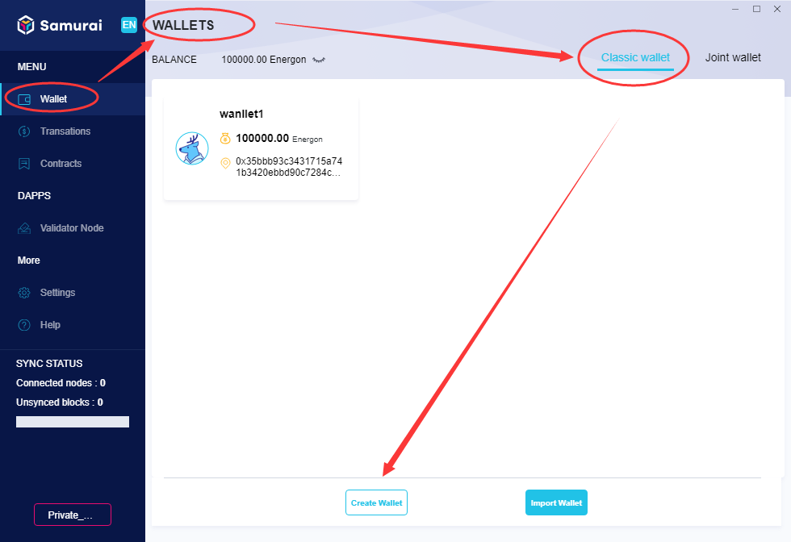

2.The client will navigate to the [Create Classic Wallet] page, input [Name], and set the wallet’s [password], click [Create], as shown below:

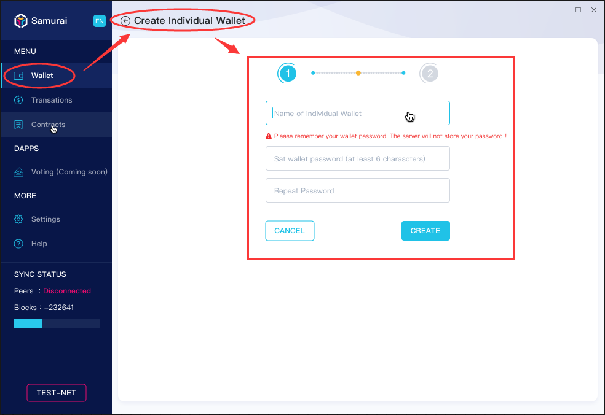

3.The wallet is created successfully. The page displays the created wallet [Label], [Address], [Public Key], [Signature Scheme], [Private Key], and pay attention to the backup wallet private key and file, as shown in the following figure:

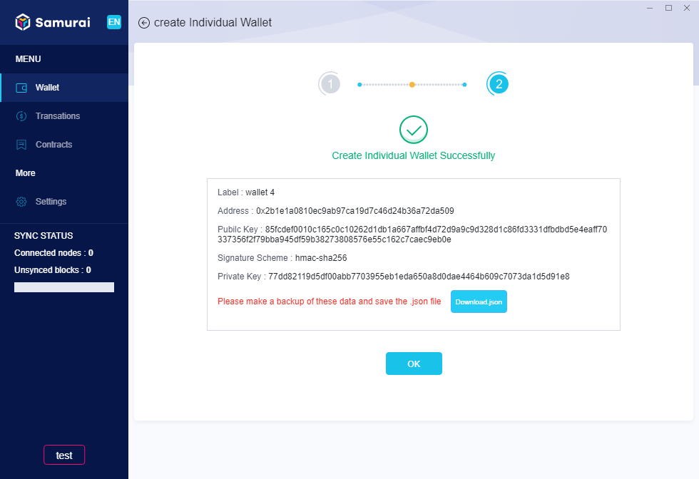

**Notes: Wallet safety**

1. *The password is used for encrypting the wallet key file. Please make sure to memorize the wallet password. Lost of password means lost of your wallet,  and cannot be recovered, since the server doesn't store your password as well. So never lost the wallet password.*

2. *Disk damage, system re-installation, or mistaken deletion will result in the loss of .json file. Therefor, be sure to back up the encrypted .json file or the private key in plain text, and ensure they won’t be leaked, deleted or lost. Once lost, the wallet cannot be retrieved.*

## How to import & restore a wallet
 After replacing the computer or re-installing the system, it is mandatory to import or restore the existing wallet to the new installed client, as following: 

1.On client’s [Wallet] home page, click [Import Wallet], as below:

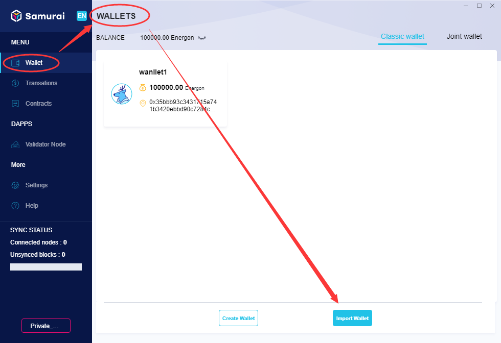

2.There are three ways to [Import Wallet]: private key (64 HEX), Keystore (.json) and mnemonic phrase. Let’s go through them one by one:

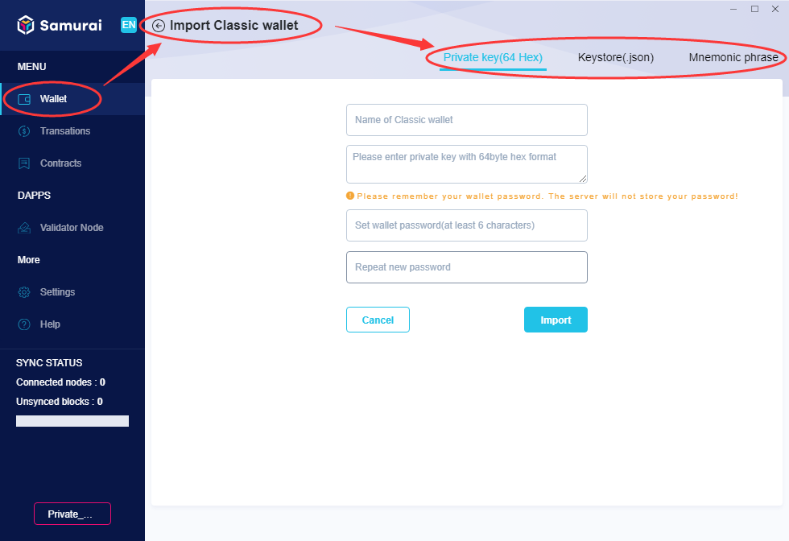

- **Private Key (64 HEX)**
Input the private key of the wallet, set up a new [wallet name], and [wallet password], click [Import]. Once done successfully, the details of the new wallet imported will be displayed on the home page of [Wallet].

  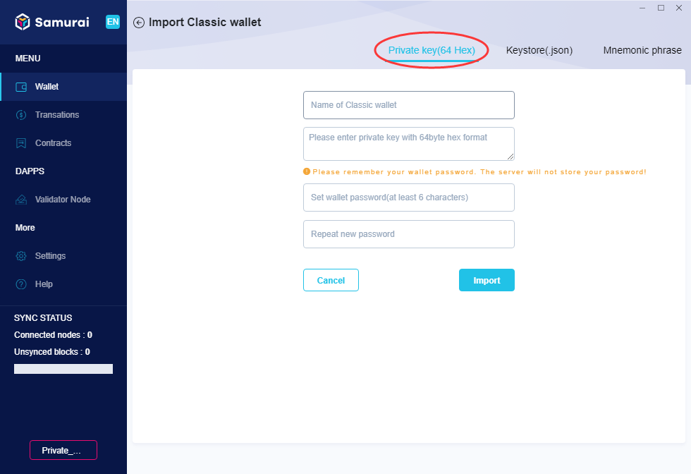

- **Keystore(.json)**
Click [Keystore(.json)] tap,  set the name of the wallet, click [Select File] to open local resource manager, select the saved .json file, and then input the preset wallet Password, click [import], after succeeding, the newly imported wallet will be displayed on the home page of [Wallet]. 

    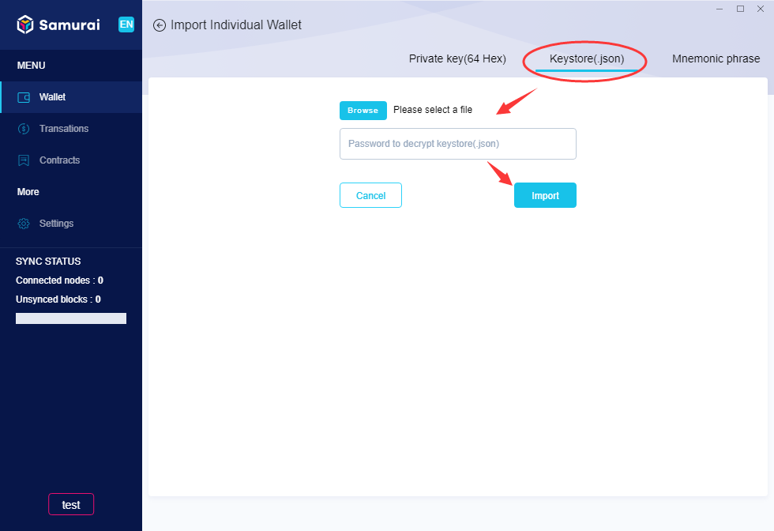

- **Mnemonic Phrase**
Click [Mnemonic Phrase] tap, input the wallet’s mnemonic phrase, set new [wallet name], and [wallet password], click [Import], once succeeded, the newly imported wallet will be displayed on the home page of [Wallet]. 

    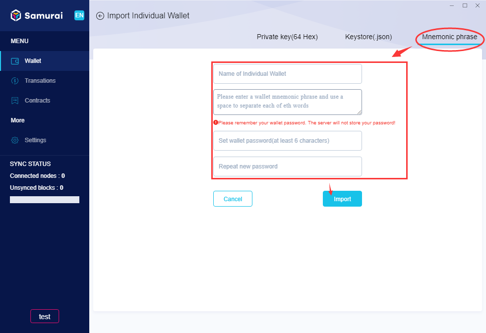

## How to send and receive funds
- **Send Energon**

1.On the home page of [Wallet], select a  Wallet , The client will navigate to the [Wallet Detail] page, Click [Send], the client switches to the page as shown below:

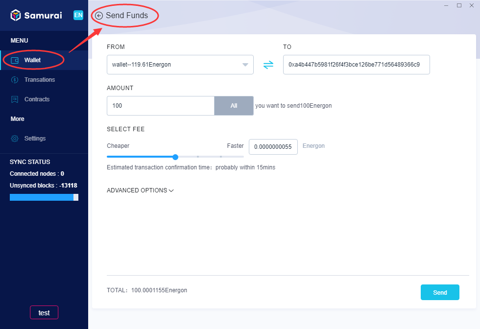

2.Select the sender, and input the receiver’s Address, set [Amount] and [fee], click [send], and the dialogue box of confirmation pops up, as shown below:

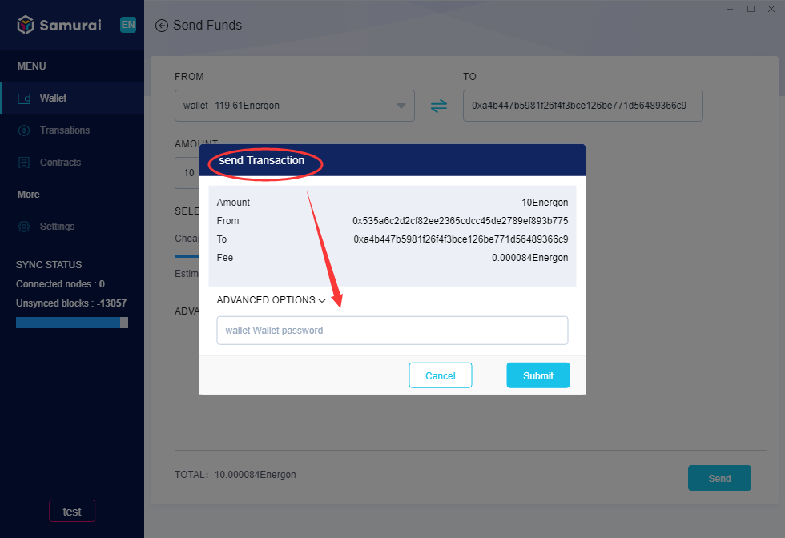

3.Input the sender’s [Wallet Password], click [Submit] to submit the transaction. The progress of the transaction can be traced on the page of wallet details, as shown below:

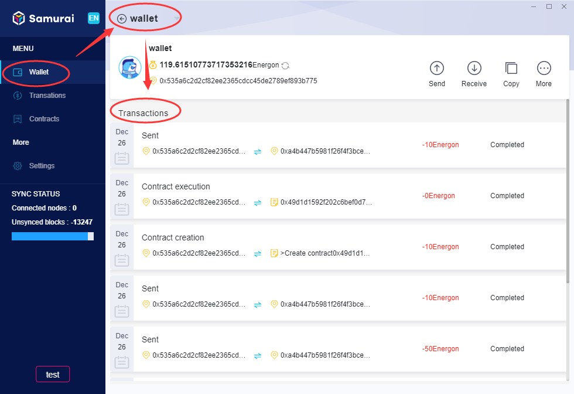

- **Receive Energon**

Click [receive], the client will display the page as below:

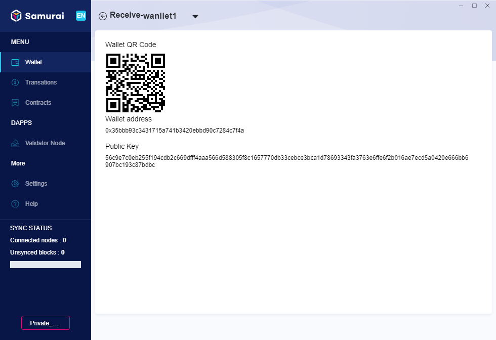

The page display the wallet’s [QR Code of Address], [Address], provide them to the sender as required.

## Why is the test Energon in the wallet cleard

During your use, if you find that your wallet's test Energon has been cleared for no reason, don't be nervous. Samurai is still in the beta. When its version is greatly updated, the data of test chain will be removed. This means that your wallet test Energon will also be cleared. We apologize for the inconvenience and bad experience of using it.
But it also indicate that Samurai has taken another big step forward. Samurai continues to iterate and optimize, and is committed to providing you with more basic and rich application functions. We hope to get your continuous attention and experience.
In order to experience the function of the latest version, you need:

1.Uninstall the Samurai client, then delete the saving folder of your wallets, as shown in the following figure:

2.Click [here](https://download.platon.network/Samurai-windows-amd64.exe) to download the latest installer and reinstall it.

3.After Installation, re-create your wallet and re-apply for the test Energon through [test Energon application channel](https://developer.platon.network/#/).

