## What is joint wallet
 A joint wallet is a digital wallet controlled and managed by multiple users. Transaction of the joint wallet needs to gain predefined more than one signatures before it can be executed.

## How to create a joint wallet

1.On the page of [Wallet]-[Joint Wallet], click [Create Wallet], as shown below.

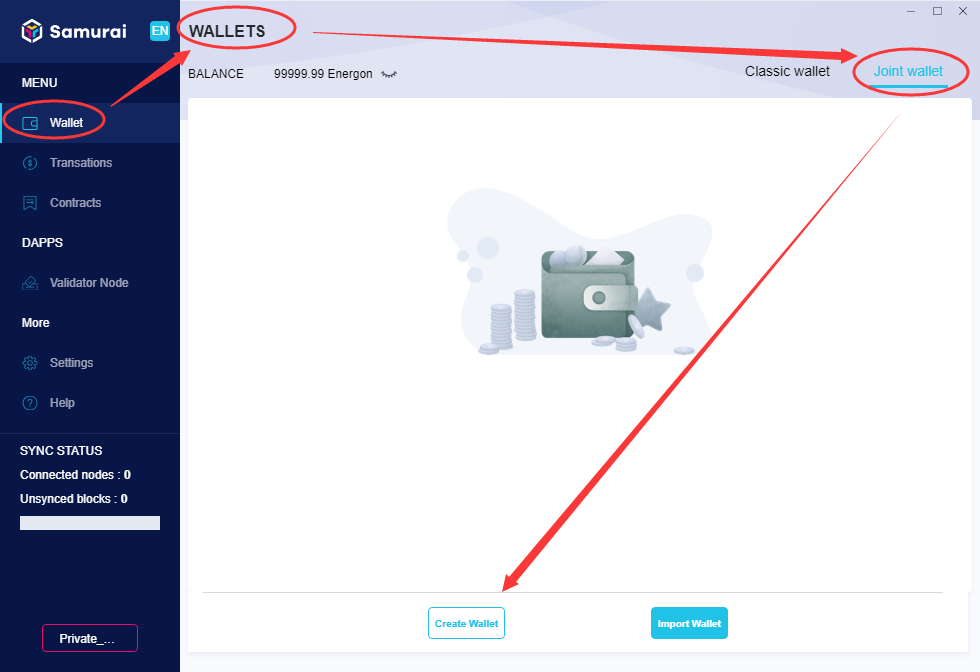

2.Name the Joint wallet and select current owner (i.e. an classic wallet), then input at least one or more other joint owners (also classic wallet) to share with, and click [Next], as shown below:

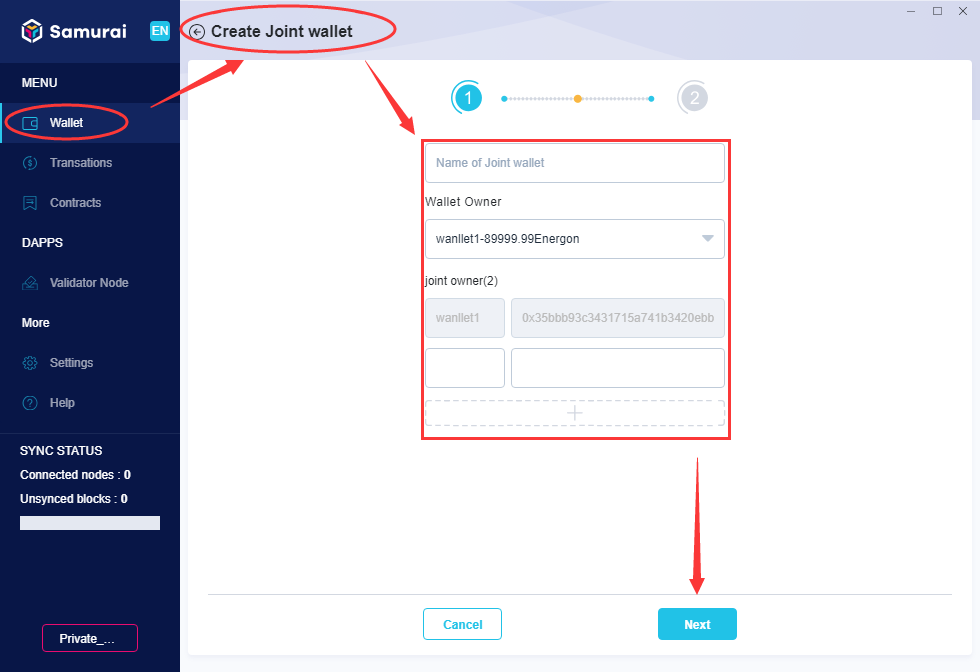

3.Set [Required Signatures] to determine how many signatures needed for a transaction, click [Create], as shown below:

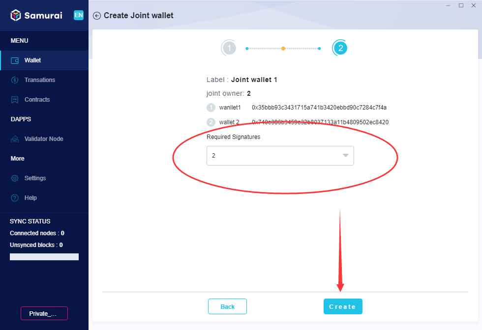

4.In the dialogue box of confirmation that pops up, input the associated classic wallet’s password (the owner who create the joint wallet), click [Submit],as shown below.

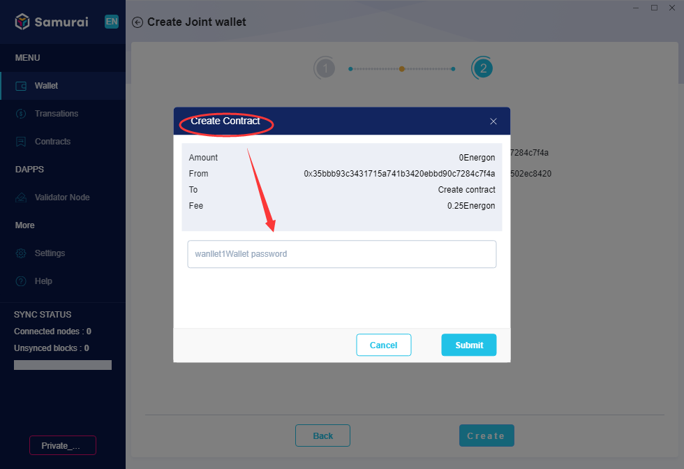

5.Once done, the new wallet will be displayed on the [Joint Wallet] page and works minutes later.

## How to add a joint wallet that has been created
An existing joint wallet can be added by user into their [Joint wallets], the steps are as below.

1.On the page of [Wallet]-[Joint Wallet], click [Import Wallet], as shown below:

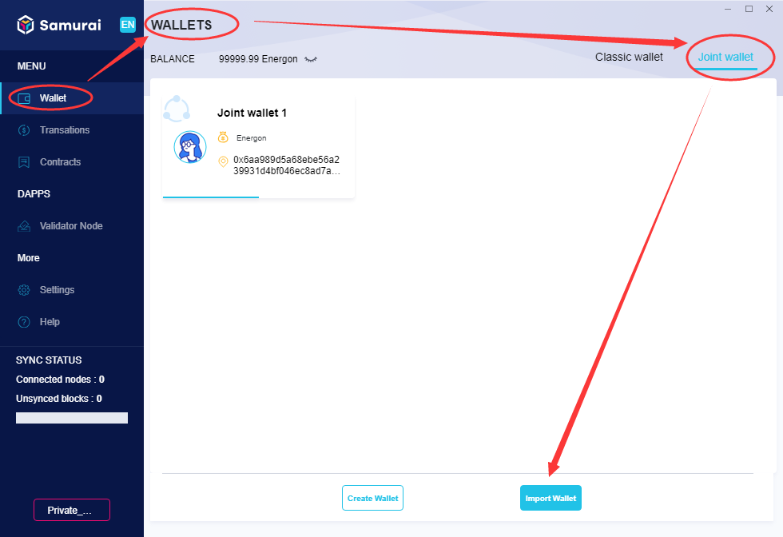

2.The client will navigate to the [Add Joint Wallet] page, name the Joint wallet, input [Joint Wallet Address], click [Add], as shown below:
   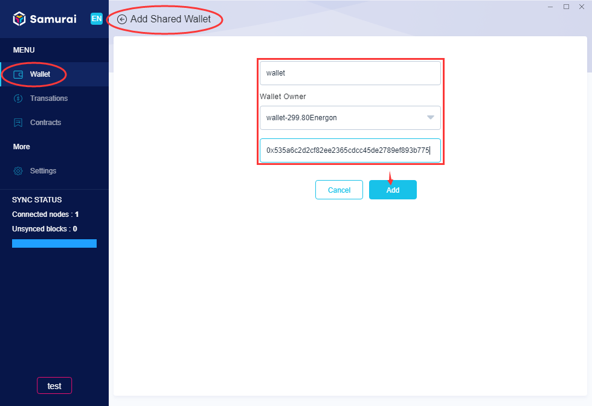

3.After completing，the client will synchronize the existing joint Wallet’s balance data automatically.

## How to send and receive funds with shared wallet

+ **send Energon**

1.Click [Send], the client switches to the page as shown below:

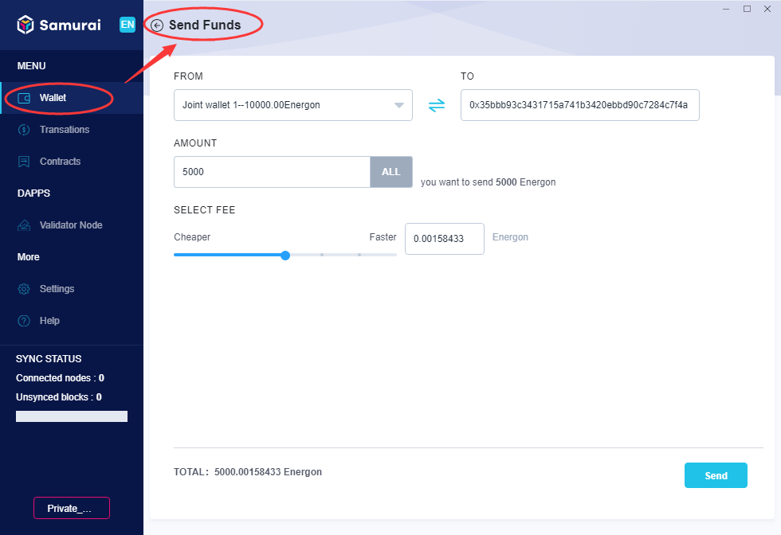

2.Select the sender, and input the receiver’s Address, set [Amount] and [Fee], click [Send], and the confirmation dialogue box pops up as below:

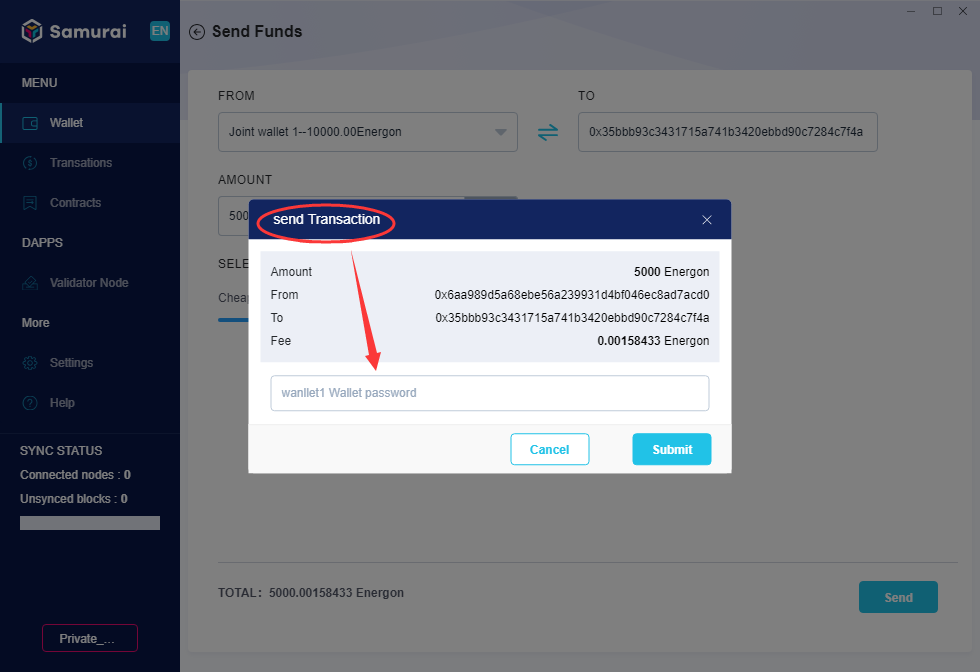

3.Input the owner’s [Wallet Password] of joint wallet, click [Submit] to create the transaction, and the progress of the transaction is displayed on the page of joint wallet details, as shown below:

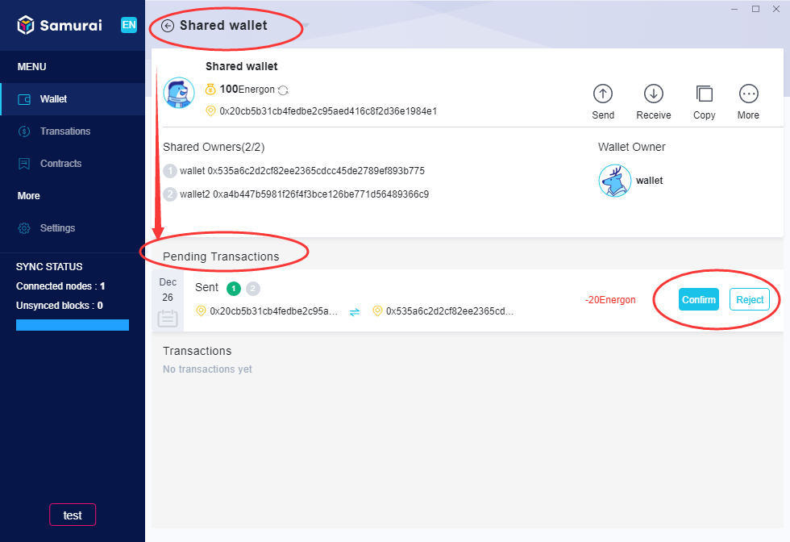

4.Unlike the classic wallet, the joint wallet requires a number of signatures before executing a transaction. So after a transaction being initiated, the joint owner needs to confirm those related transactions in ‘Pending Transactions’. By click [confirm], the dialogue box of [Execute Contract-Confirm] pops up, as shown below:

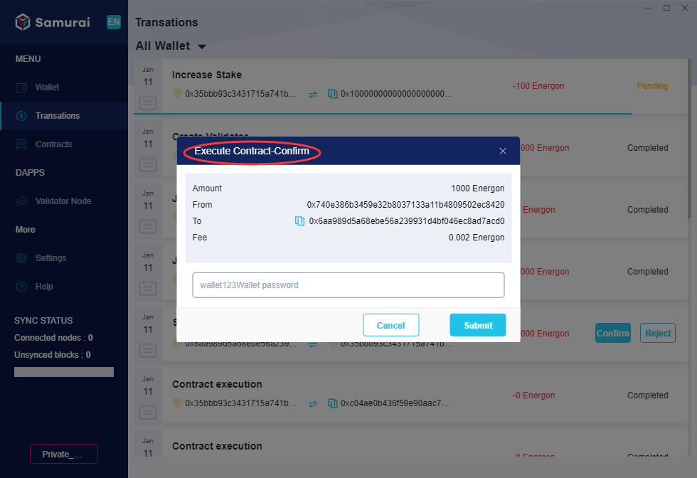

5.Input owner’s related classic [Wallet Password] of joint wallet, click [Submit], so as to confirm the transaction. It doesn't mean the transaction can be executed immediately yet. Only after all required signatures are obtained, the transaction then could be executed.

+ **Receive Energon**

Click [Receive], the client switches to the page as shown below:

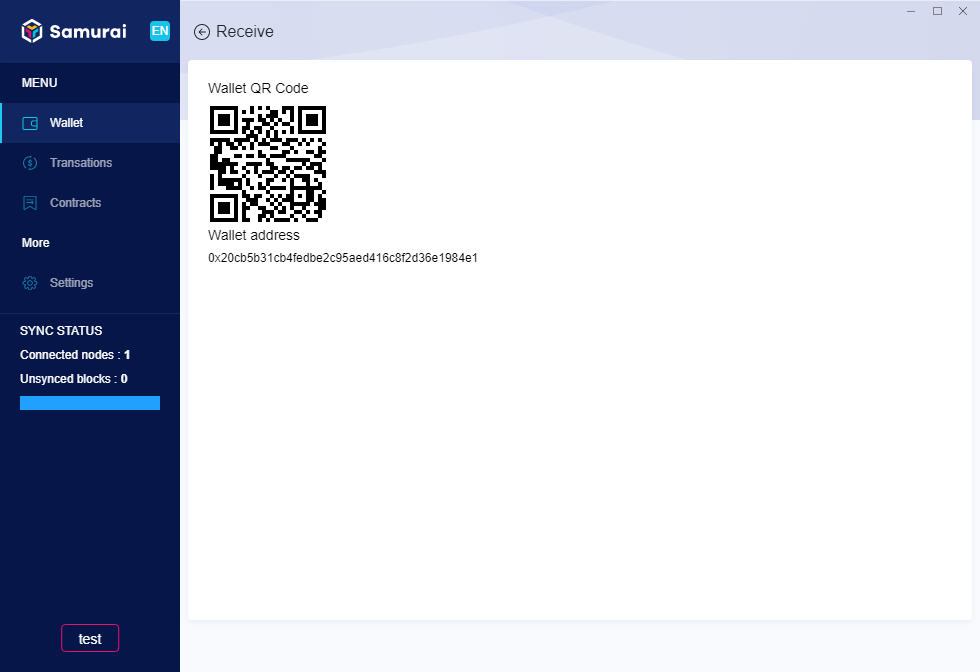

The page display the wallet’s [QR Code of Address], [Address], provide them to the sender as required.

