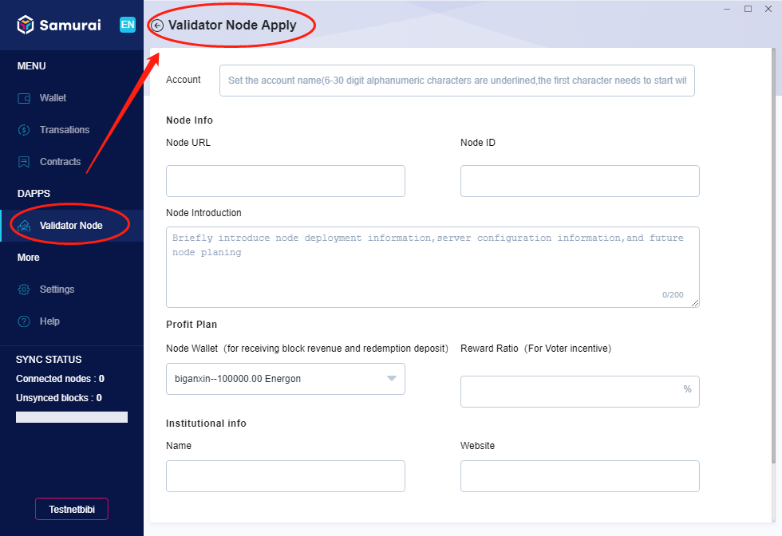

## What's candidate node
Candidate nodes are nodes which are possible to become consensus validator nodes. One node can become consensus candidates by staking. Candidate nodes will be put into a pool of candidates and a pool of alternative candidates based on designed rules. A candidate node can be voted as consensus validator node. 

One node has to apply and become a candidate node with staking first, then need to wait being voted and sorted into pools and eventually become validator node. The sequence could be described as: 

A node -> candidate node -> candidate node in pools ->consensus validator node

## How to be a validator node

On the home page of [Validator Node], click [My Validator Node]-[Not Yet], as shown below.

1.Click [Validator Node Apply], the client navigates to [Validator Node Apply], set the [Account Name], input [Node Info], and set [Profit Plan], input [Institution Info], click [Next], as shown below:

2.Select [Payment Wallet], input [Stake Amount], set the [Fee], click [Submit], as shown below:

**Note : Stake Amount**

*Assume the current candidate nodes are sorted by stake amounts, if the number of queuing candidate nodes exceeds 200, and X is the 200th candidate node’s stake amount. The newly inputted stake amount should be greater than 110% of X, otherwise it will not get accepted. In case the number of queuing candidate nodes is less than 200, then the stake amount must be greater than defined default amounts .* 

3.The confirmation dialogue box pops up, please input the Payment wallet’s [Wallet Password], click [Submit], as show below:

4.The voting may take a few minutes to complete, as shown below:

5.Once completed, the client navigates to [My wallet Node] page, as shown below:

## How to improve the probability to become validator node

PlatON ranks the top 100 nodes as candidate nodes, and ranks the top 101-200 nodes as standby nodes, and the nodes beyond 200 will be removed from candidate list, sorted by voting tickets and staking amount.
The more staking amount, the higher the ranking, and results higher probability to become validator node. So to increase the staking amounts of stake, can improve the probability effectively.

1.On the [My Validator Node] page, click [Increase Stake], as shown below:

2.On [Increase Stake] page, select the [Payment Wallet], input [Stake Amount], and set the [Fee], click [Submit], as shown below:

**Note : Stake Amount**

*Increase stake,the stake amount cannot be less than 10% of the this candidate node Staked*

3.The confirmation dialogue box pops up, input the payment wallet’s [Wallet password], click [Submit], as shown below:

4.Status of increasing staking amount after submit, as shown below:

## Why are candidate nodes eliminated

As described before, PlatON ranks the top 100 nodes as candidate nodes, and ranks the top 101-200 nodes as alternative nodes, and the nodes beyond 200 will be removed from candidate list, sorted by voting tickets and staking amount. So, when a new node with enough staking and voting tickets appears within top 200 ranking, the current 200th candidate node will be replaced, and the voting tickets associated will be released as well.

The more staking amount, the higher the ranking, and results higher probability to become validator node. So to increase the staking amounts of stake, can improve the probability effectively.

## How to re-apply for validator node if eliminated

One the page of [My Validator Note], click [Rejoin], the client will return to the process of applying for validator node, you can click [How to be a validator node](_Validator Node#how_to_be_VN) to view the operation process.

## How to withdraw the application
1.On the page of [My Validator Node], click [Revoke Validator Node], a warning dialogue box pops up, click [Submit], as shown below:

2.The dialogue box of confirmation pops up, input the node’s [Wallet password], click [Submit], as shown below:

3.After submitting, on the page of [My Validator Node], the processing status of revoking validator node will be displayed, as shown below:

## How to redeem the stakes

Stake being reduced, node being eliminated, or revoking Validator node, for any of these reasons, you can apply for redeeming the stake, the steps are as below.

1.On the page of [My Validator Node], click [Redeem], and a tip pops up, click [confirm], as shown below:

2.The dialogue box of confirmation pops up, and input the node’s [Wallet password], click [Submit], as shown below:

3.The system starts to process the stakes’ redemption, and on the page of [My validator Node] will display the status of redemption. As shown below:

**Note : Stake redemption**

*The released stakes need to be redeemed proactively, for they won’t return to the payment wallet automatically.*

