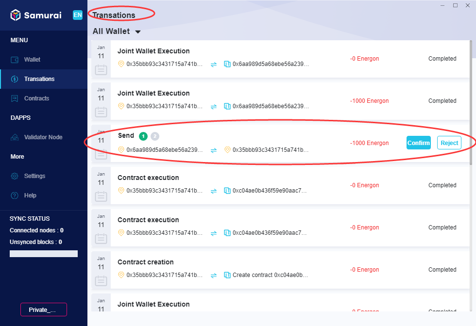
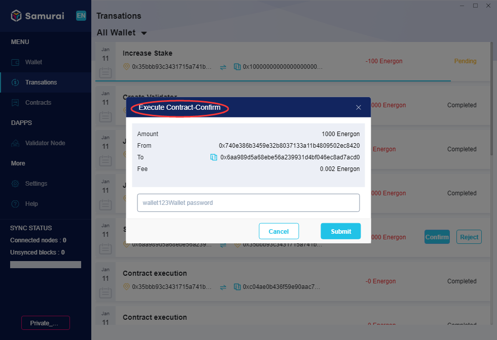
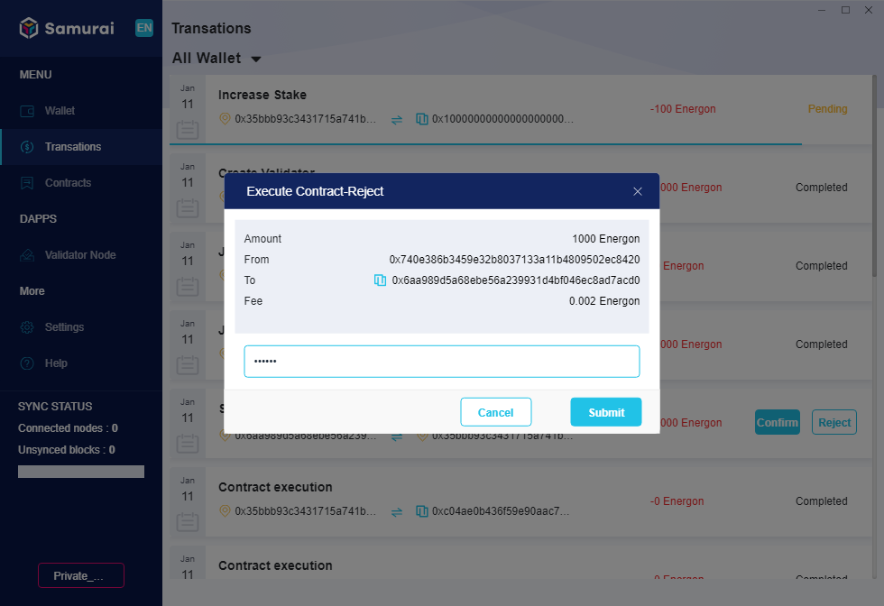

## How to confirm a transaction

[Transaction] page displays all transaction records of all your wallet. By selecting and clicking one of them, the client navigates to [Transaction Information] of transaction details.

Joint wallets requires signature confirmation by multiple joint users. Therefore, in the transaction list, it is necessary to "confirm" or "reject" transactions pending confirmation of joint wallets.

For those transactions to be confirmed, there will be a “Confirm” button as shown below:

1.**confirm**

In the list of transactions, for those to be confirmed, as shown below:

Click [Confirm], the dialogue box of [confirm] pops up, as shown below:

Input the owner’s [Wallet Password] of joint wallet, click [Submit], and the transaction is confirmed.

2.**Reject**

Click [Reject],  the dialogue box of [confirm] pops up, as shown below:

Input the owner’s [Wallet Password] of joint wallet, click [Submit] to reject the transaction. But it doesn't mean termination of the transaction, the transaction may still get enough signatures to be executed. 

