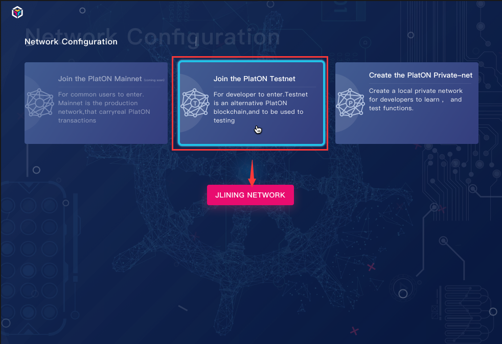
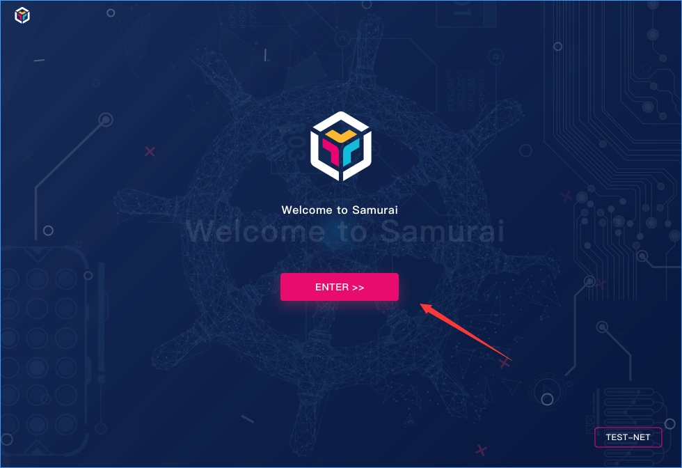
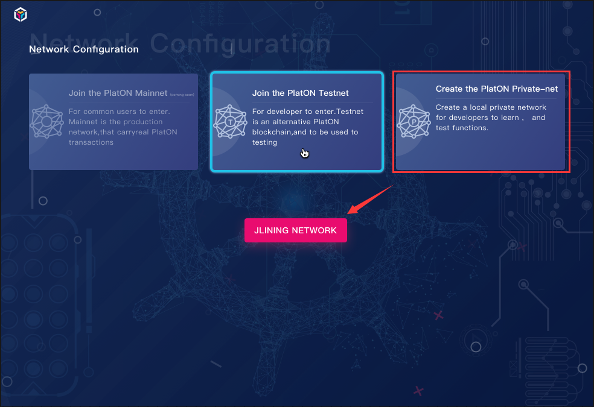
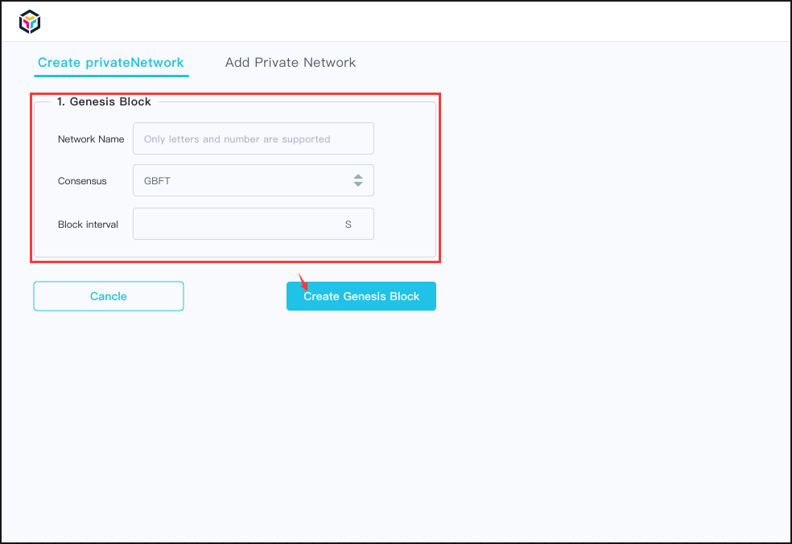
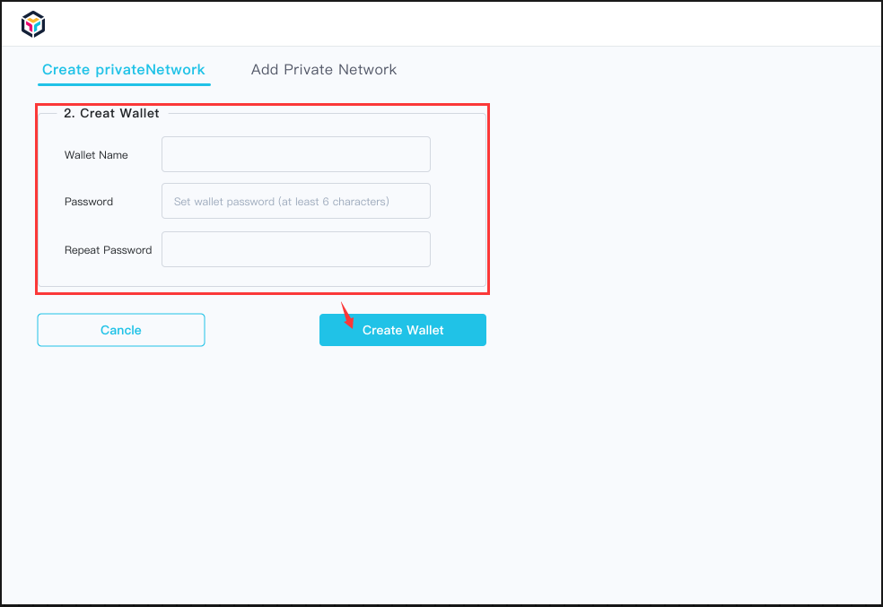
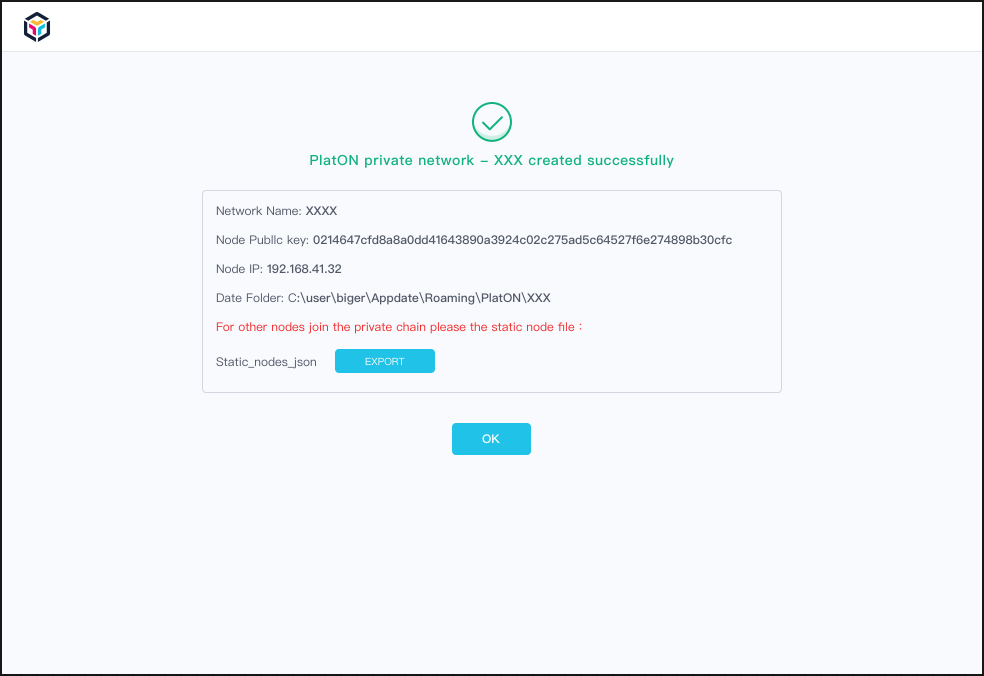

## How to join in PlatON TestNet

1.When client starts the first time, it switches to the ‘Network Configuration’ interface. Select [Join the PlatON Testnet],click [JOINING NETWORK], the system will initiate as testnet node, connect to the testnet, and synchronize transaction data of blocks.

2.Then the client switches to the ’Welcome to PlatON Samurai’ interface, click [ENTER]. Congratulations! You have successfully joint PlatON TestNet!

## How to create and join in PlatON Private-net

### Creating private-net

1.When client starts the first time as above, it shows ‘Network Configuration’ interface. Please select [Create the PlatON Private-net],click [JOINING NETWORK],  as shown below.

2.Configure the [Genesis Block] (1-10s recommended for block interval), click [Create Genesis Block] when completed, as shown below:

3.Create a [Coinbace] wallet, fill in all fields and click [Create wallet] as next step, as shown below:

4.Configure the [nodes Inforamtion], fill in all fields. Then click [Init and Start Node] to initialize Genesis Block Data and Nodes, as shown below:

5.Result confirmation at the end. Below is a sample of successful building of a PlatON private network. It is recommended that you click [Backup Wallet] to save the Coinbace Wallet to a secure place.

**Note: **

*To learn how to get the node's private key, IP, port, click [here*](https://github.com/PlatONnetwork/wiki/wiki/[English]-Private-Networks)

