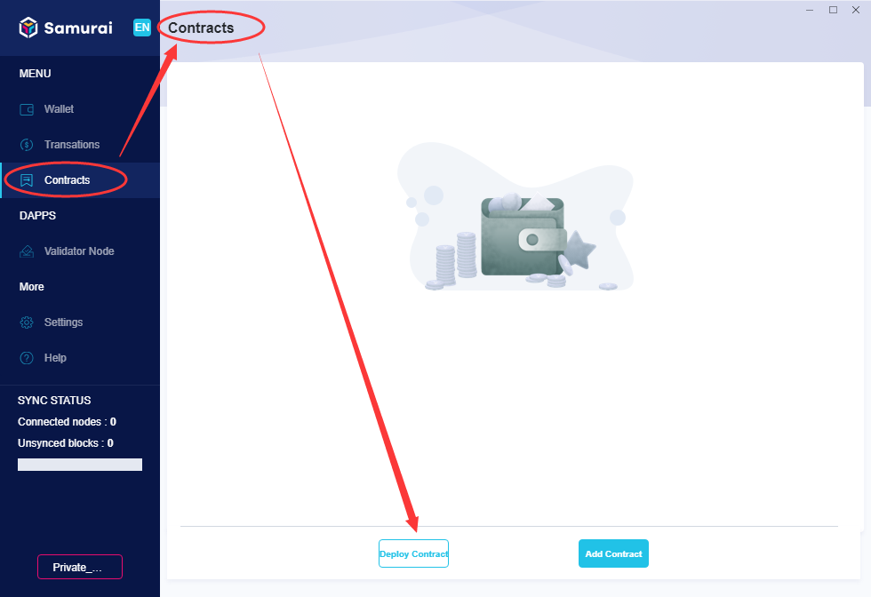
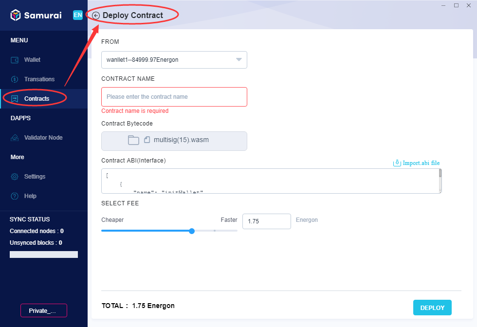
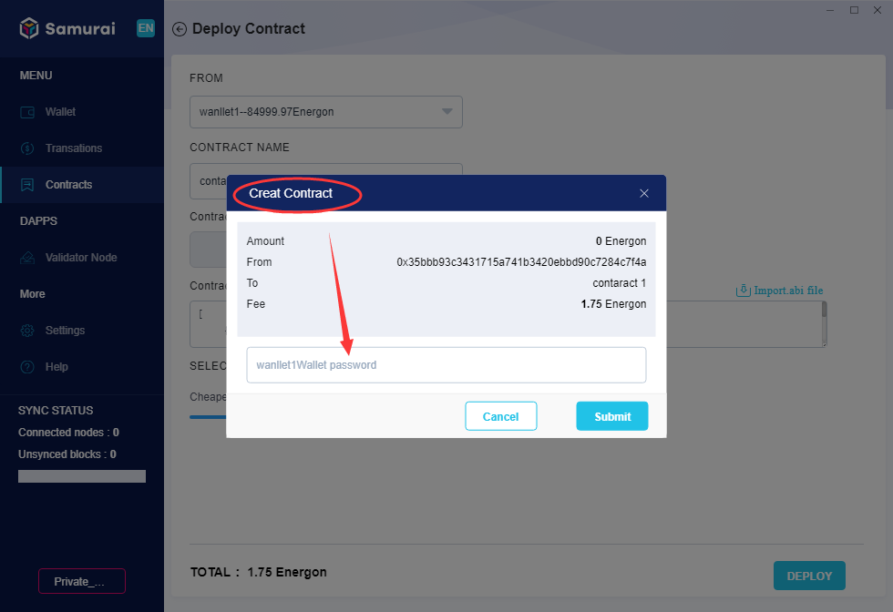
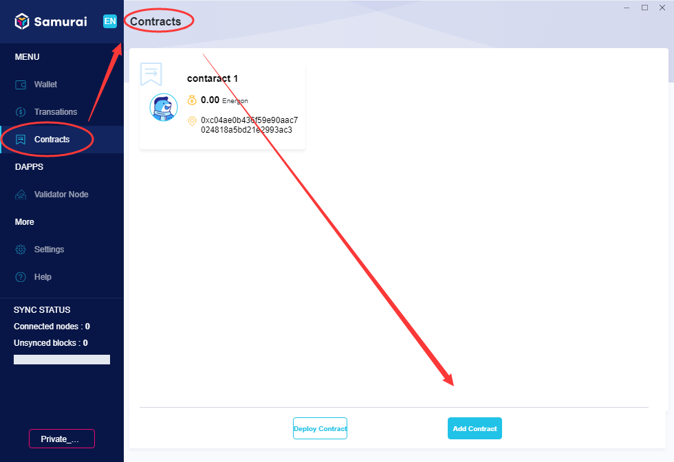
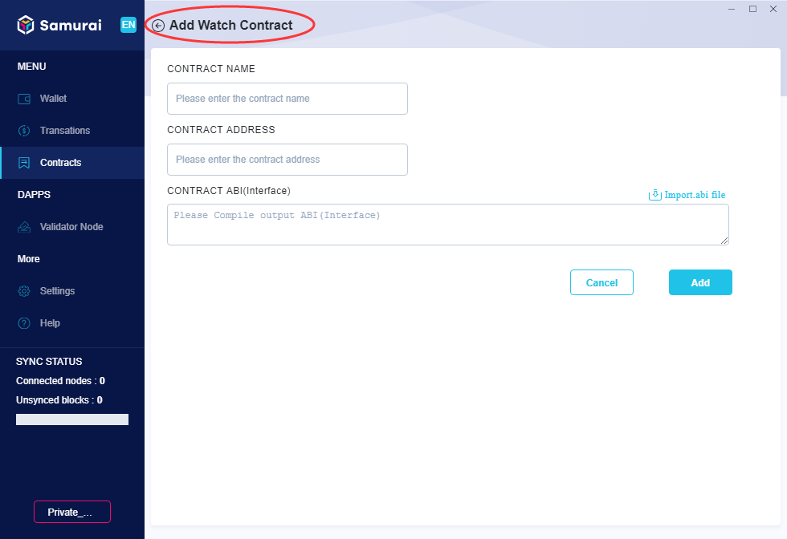
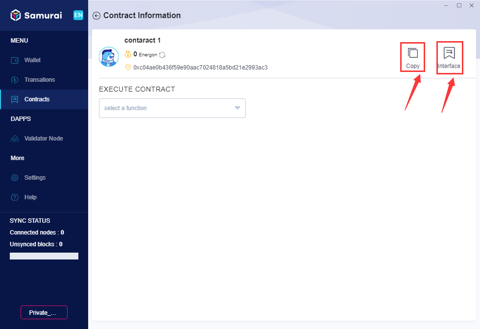
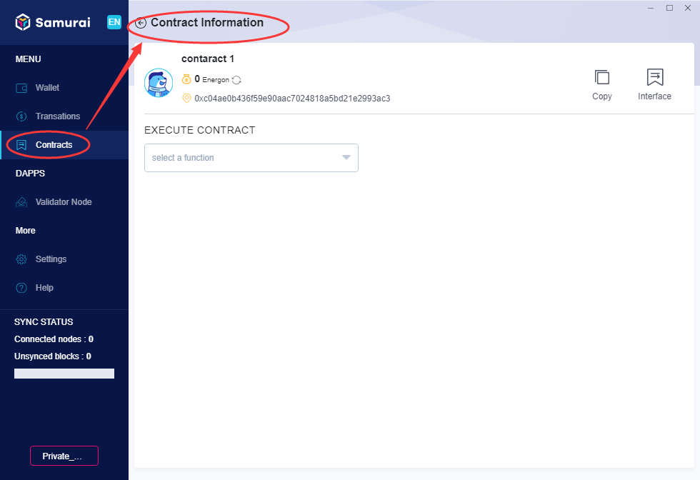
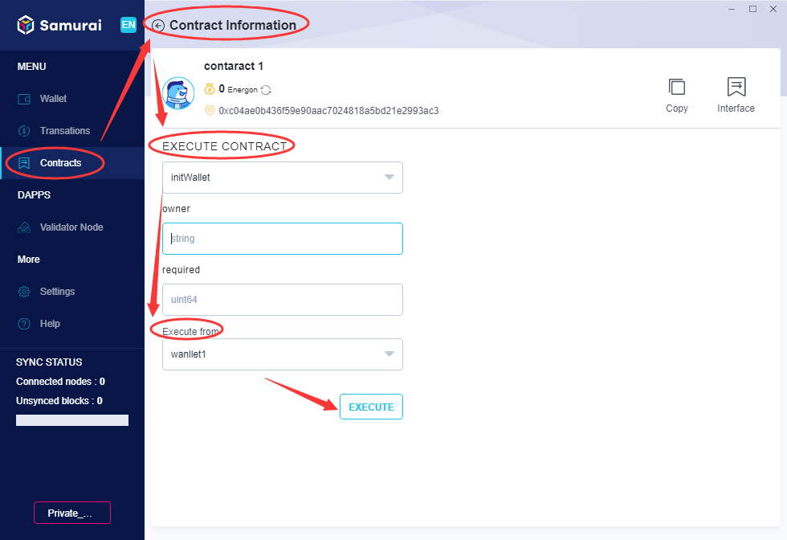
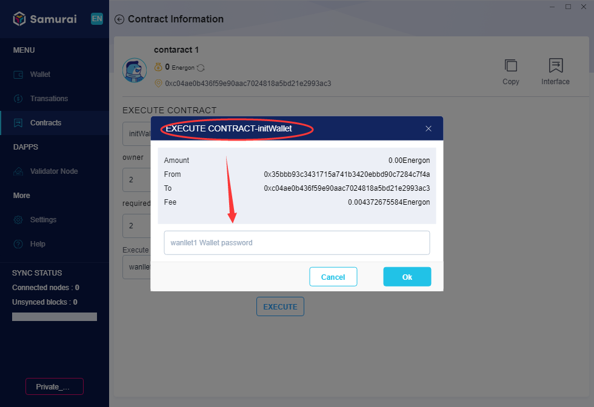

## What is Wasm contract
Wasm contracts are applications built with webassebly. and deployed on PlatON. User can publish services directly by submitting code then deploying it via PlatON Samurai.

## How to deploy a contract

1.On the [Contracts] page, click [Deploy Contract], as shown below:

2.The client switches to [Deploy Contract] page, select the sender (From which wallet), import [Contract Bytecode] and [Contract ABI(Interface)], set [Fee], click [Deploy], as shown below:

3.A dialogue box will pop up as below，input the sender’s [Wallet Password], click [Submit], and the contract starts to be deployed.

**Note : Contract Bytecode**

*Wasm contract can be written with the contract development framework (reference [link to be confirmed]). After compiling, you can get a binary code file suffixed with .wasm, which is an executable instruction of the virtual machine, and the execution of the contract logic is completed by instruction sets on the virtual machine.*

**Note: Contract ABI (Interface)**

*After the contract being compiled, an ABI file suffixed with .json will also be generated. ABI is the abbreviation of Application Binary Interface, which can be understood as a contract interface description. after the contract being compiled, its corresponding ABI is also formed. ABI is somewhat similar to the interface definition in the program, describing the field name, field type, method name, parameter name, parameter type, method return value type etc.*

## How to add a contract that has been created 
After a contract being created by someone, you can add it to your client, the steps are as below.

1.On the [contract] page, click [Watch Contract], as shown below:

2.The client switches to [Watch Contract] page, input [Contract Name], [Contract Address], [Contract ABI (Interface)], click [Add], as shown below:

3.Once completed, the newly added contract will be displayed on the home page of [Contract]. 

**Note: Send Contract Interface & Address**

*You need to provide the contract interface and the contract address when Other users are adding contracts that you have deployed.  You can click the [Copy] button on the contract details page to get the contract address, click [interface] to copy and get the contract interface, and then send them to the users.*

As shown in the following figure:

## How to execute a contract

1.On the home page of [Contract], select an existing contract, the client navigates to [Contract Information] page, as shown below:

2.Select the function of contract to be executed, input relevant parameters, selected the executor, click [Execute], as shown below:

3.The confirmation dialogue box pops up, input Executor’s [Wallet Password], the contract’s function start to be executed.

