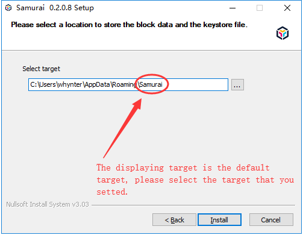

> A open-source graphical desktop wallet client

## What is Samurai

Samurai is PlatON's open-sourced digital wallet desktop client terminal (the client), which can manage basic wallet as well as multi-signature wallet (or Joint wallet). It also provides deployment and operational guides of meta-smart contracts for developers, procedures of PlatON private chain building, voting mechanism of candidate nodes according to PlatON economic model, participation rules of PlatON ecosystem governance etc.

In the future, Samurai will provide more rich functions for different users, and we are dedicated to help user to understand and use the PlatON ecosystem better and deeper.

**Core function are listed as below:**

- Building PlatON Private network (a.k. private chain)

- Wallet creation & importation (supports Keystore, Mnemonic phrase, private key)

- Joint wallet(multi-signature) creation and importation 

- Management of wallet balance and transaction details

- Transaction of PlatON Energon

- Contracts debug test and deployment

- Application for Validator candidate node with staking

- Participating in Validator node voting (To be released)

Btw, Current Samurai is a beta release. This manual intents to help you solving common issue, please feel free to submit any relevant questions at [issues](https://github.com/PlatONnetwork/wiki/issues),  and welcome to join our technical community!


## How to download and install Samurai

At present，Samurai can run on Windows and Linux, please click [here](https://github.com/PlatONnetwork/Samurai/releases) to download. In the future, Samurai will also support running on MacOS system, Please look forward to it. 

+ **Brief installation instruction on Windows:**


```
1.Download Windows installer samurai.exe.
2.Dual-click the installer and follow the Installation wizard.
3.Shortcut of Samurai will be created on the desktop automatically.


```
**Note**:  

*Just follow the Installation wizard for the first time Samurai being  installed, otherwith,  you need to manually delete the folder (Default path: <u>C:\Users\Username\AppData\Roaming\Samurai</u>，and the Username is the account name of your login to the PC. ) where you saved the Blockchain data and as shown in the following figure, and then follow the installation wizard to install.*





+ **Brief installation instruction on Linux:**


```
Installation instruction of tar.xz package.
1.Download Linux Samurai package,such as Samurai-Linux64.tar.xz
2.Right click to extract the installation package.
3.Go to the extracted folder and double-click the executable Samurai to open the client.
```

+ **Brief installation instruction on MacOS:**

MacOS is not supported for the time being

## How to use Samurai

### Network

- [How to join in PlatON TestNet](en-us/user-interfaces/platon-samurai-EN/_join-in-a-Network#How-to-join-in-PlatON-TestNet)

- [How to create a PlatON Private-net](en-us/user-interfaces/platon-samurai-EN/_join-in-a-Network#How-to-create-a-PlatON-Private-net)

### Wallet

- [How to create a wallet](en-us/user-interfaces/platon-samurai-EN/_Classic-Wallet#How-to-create-a-wallet)

- [How to import & restore a wallet](en-us/user-interfaces/platon-samurai-EN/_Classic-Wallet#how-to-import-amp-restore-a-wallet&-restore-a-wallet)

- [How to send and receive funds](en-us/user-interfaces/platon-samurai-EN/_Classic-Wallet#How-to-send-and-receive-funds)

- [Why is the test Energon in the wallet cleard](en-us/user-interfaces/platon-samurai-EN/_Classic-Wallet#Why-is-the-test-Energon-in-the-wallet-cleard)

### Joint Wallet

- [What is Joint wallet](en-us/user-interfaces/platon-samurai-EN/_Joint-Wallet#What-is-joint-wallet)
- [How to create a Joint wallet](en-us/user-interfaces/platon-samurai-EN/_Joint-Wallet#How-to-create-a-joint-wallet)

- [How to add a Joint wallet that has been created](en-us/user-interfaces/platon-samurai-EN/_Joint-Wallet#How-to-add-a-joint-wallet-that-has-been-created)
- [How to send and receive funds with Joint wallet](en-us/user-interfaces/platon-samurai-EN/_Joint-Wallet#How-to-send-and-receive-funds-with-Joint-wallet)

### Transaction

- [How to confirm a transaction](en-us/user-interfaces/platon-samurai-EN/_Confirm-Transactions#How-to-confirm-a-transaction)

### Wasm contracts

- [What is wasm contract](en-us/user-interfaces/platon-samurai-EN/_Wasm-Contracts#What-is-Wasm-contract)

- [How to deploy a contract](en-us/user-interfaces/platon-samurai-EN/_Wasm-Contracts#how-to-deploy-a-contract)

- [How to add a contract that has been created ](en-us/user-interfaces/platon-samurai-EN/_Wasm-Contracts#How-to-add-a-contract-that-has-been-created)

- [How to execute a contract ](en-us/user-interfaces/platon-samurai-EN/_Wasm-Contracts#How-to-execute-a-contract)

### Validator Node

- [What’s candidate node](en-us/user-interfaces/platon-samurai-EN/_Validator-Node#What's-candidate-node)

- [How to be a validator node](en-us/user-interfaces/platon-samurai-EN/_Validator-Node#How-to-be-a-validator-node)

- [How to improve the probability to become validator node](en-us/user-interfaces/platon-samurai-EN/_Validator-Node#how-to-improve-the-probability-to-become-validator-node)

- [Why are candidate nodes eliminated](en-us/user-interfaces/platon-samurai-EN/_Validator-Node#Why-are-candidate-nodes-eliminated)

- [How to re-apply for validator node if eliminated](en-us/user-interfaces/platon-samurai-EN/_Validator-Node#how-to-re-apply-for-validator-node-if-eliminated)

- [How to withdraw the application](en-us/user-interfaces/platon-samurai-EN/_Validator-Node#How-to-withdraw-the-application)

- [How to redeem the stakes](en-us/user-interfaces/platon-samurai-EN/_Validator-Node#How-to-redeem-the-stakes)

