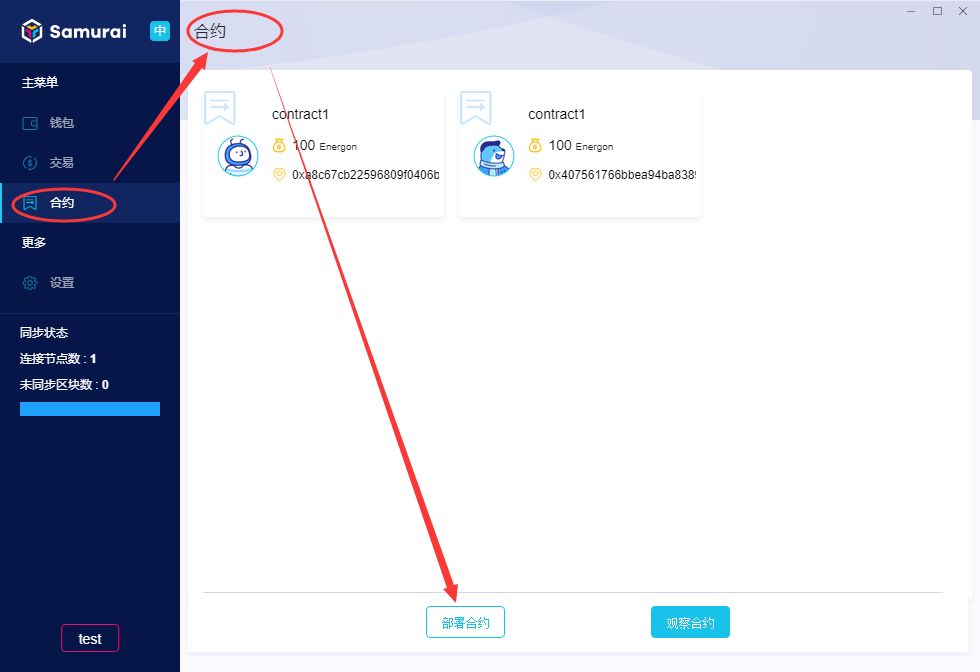
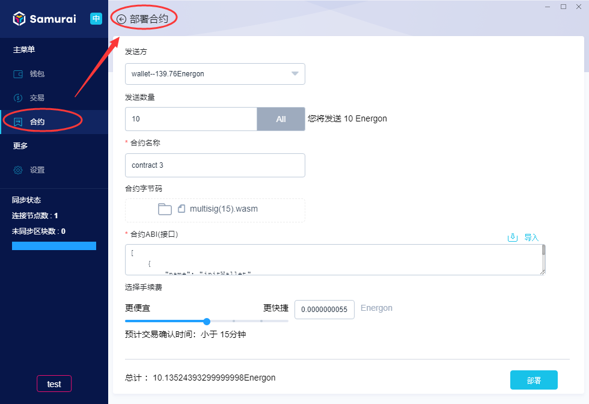
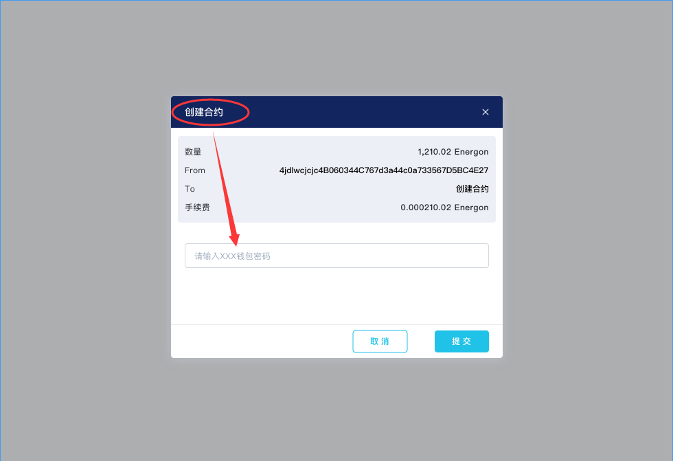
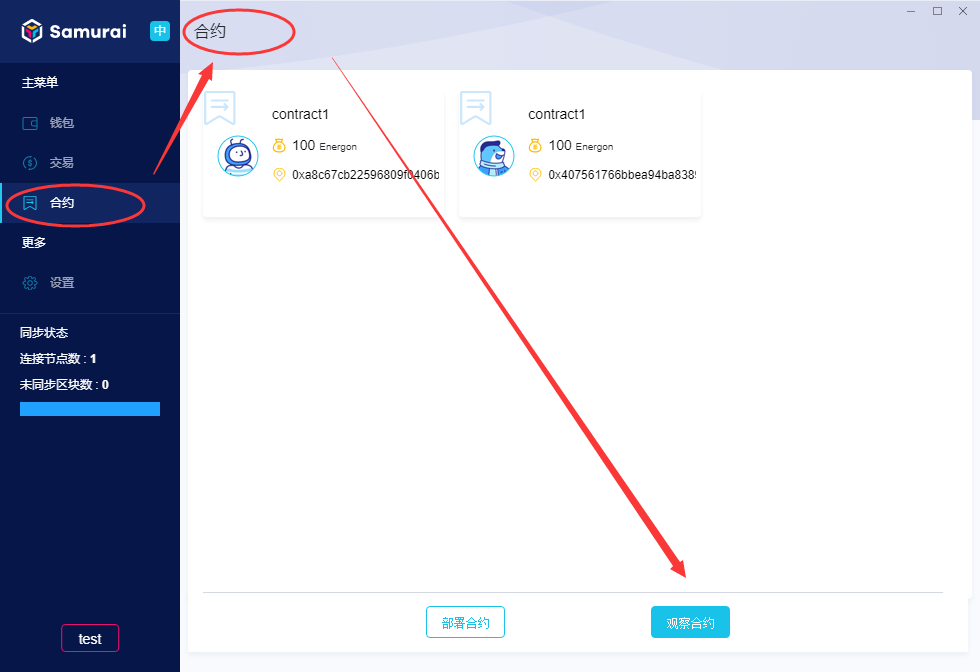
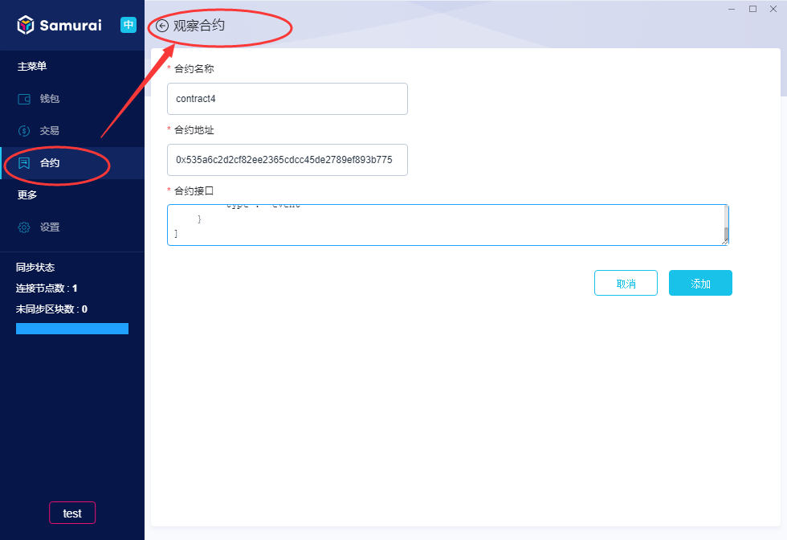
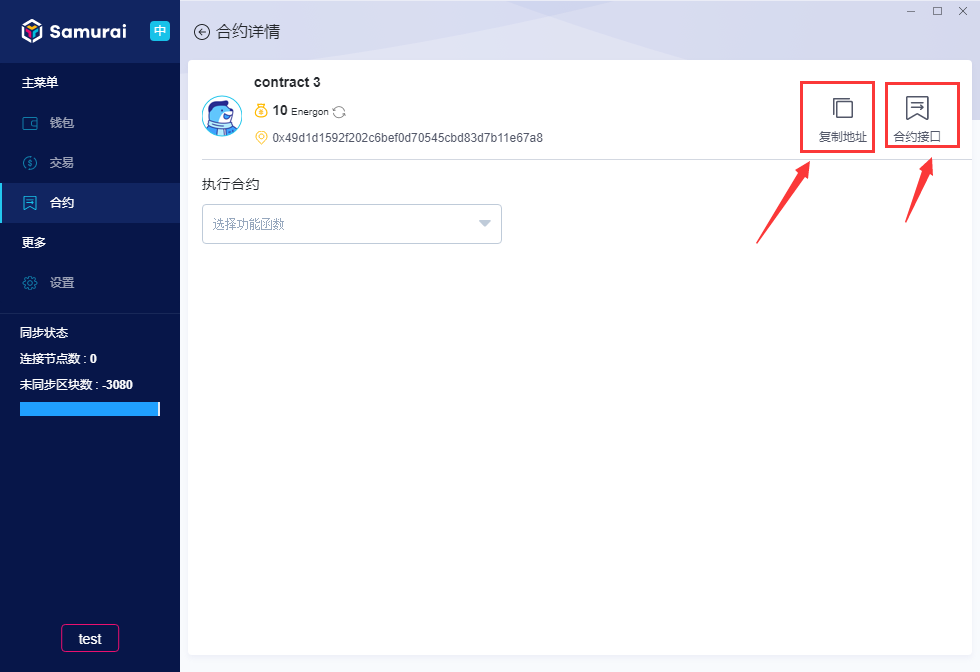
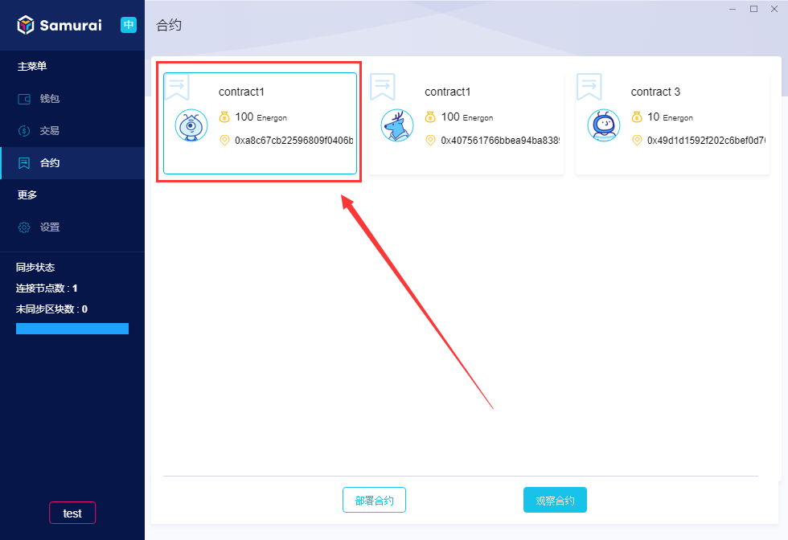
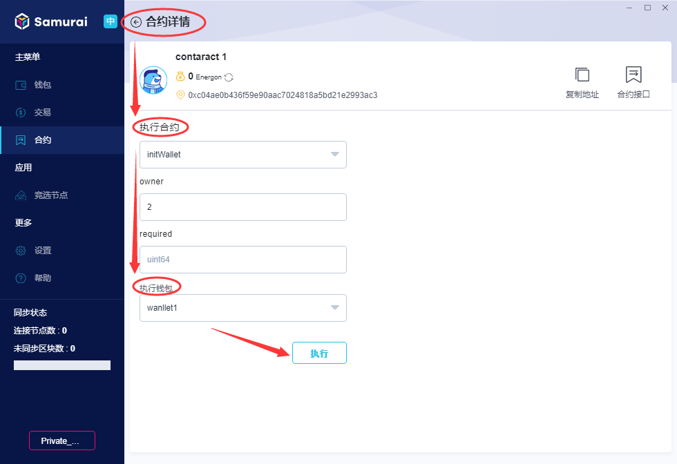
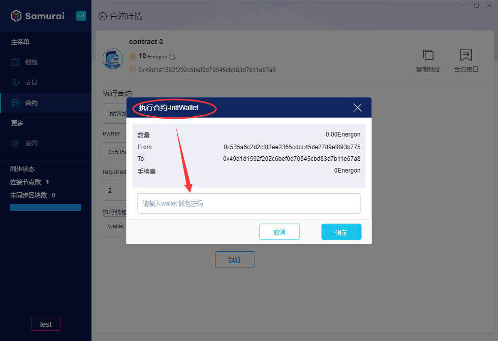

## Wasm合约是什么
Wasm合约是使用webassebly构建，部署于PlatON上的应用。用户只需要通过Samurai客户端提交Wasm合约代码到PlatON上，就可以对外发布服务。

## 如何部署一个Wasm合约

1.客户端【合约】页面，点击【部署合约】，如下图所示：

2.页面切换进入【部署合约】页面，选择【发送方】、资产【发送数量】（非必填项）,导入【合约字节码】、【合约ABI（接口）】，设定手续费，点击【部署】，如下图所示：

3.在弹出的确认对话框中，输入发送方【钱包密码】，点击【提交】，则该合约开始上链。

**注：合约字节码**

*使用合约开发框架(使用参考【链接待确认】)编写智能合约，编写完成后可生成文件后缀为.wasm的合约二进制代码，该二进制文件为虚拟机执行指令，合约逻辑的执行在虚拟机中通过各指令集组合完成。*

**注：合约ABI（接口）**

*在合约编译后，也会产生一份后缀为.json的ABI文件。ABI全称 Application Binary Interface，字面意思是应用程序二进制接口，可以通俗地理解为合约的接口说明，当合约被编译后，它对应的ABI也就确定了。ABI有点类似于程序中的接口定义，描述了字段名称、字段类型、方法名称、参数名称、参数类型、方法返回值类型等。*

## 如何添加别人已部署的合约
一个合约创建完成之后，其他用户可以将该合约添加到客户端进行观察及运行，添加步骤如下：

1.客户端【合约】页面，点击【观察合约】，如下图所示：

2.进入添加【观察合约】页面，输入【合约名称】、【合约地址】、【合约接口】，点击【添加】，如下图所示：

3.合约添加完成，在合约页面即可查看该合约。

**注：发送合约接口和地址**

*其他用户在添加您已经部署的合约，需要您提供【合约接口】和【合约地址】，您可以在合约详情页面点击【复制链接】获取【合约地址】，点击【合约接口】并复制获取【合约接口】，然后发送给他们即可。*

具体操作如下图所示：

## 怎样运行Wasm合约

1.【合约】页面，点击任意一个创建好的合约，进入该合约详情页面，如下图所示：

2.选择要执行的合约功能函数，输入相关参数，选择【执行钱包】，点击【执行】，如下图所示：

3.弹出确认对话框，输入执行钱包密码，点击【提交】，则该合约交易及发送成功。

