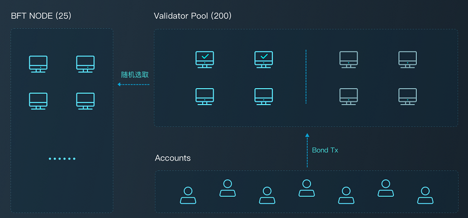

## PPoS协议



所有PoS系统都会存在去中心化（共识节点数量）和可扩展性（TPS）之间的权衡问题。DPoS偏向较少的共识节点，换取较高的性能。Algorand采用随机方式在全网选取共识节点，但是只能在强同步网络上运行。这是两个典型的极端方法。PlatON采取折衷的方法，这个候选人列表中采用VRF和概率分布方式随机选取。这种方法缩小了共识节点的选取范围，又有效避免了过于中心化的问题。

### 相关角色

**投资人：** 所有持有Energon的用户都称为投资人。投资人可通过质押Energon参与PlatON网络的共识，获取一定的收益和回报。

**候选节点：** 投资人按照条件搭建PlatON节点并质押一定的Energon，即可成为候选节点。

**候选池：** 候选节点全部进入候选池，候选池最多容纳200人。质押的Energon数量要进入前200名才能进入候选池成为候选节点。

**验证节点：** 每一轮共识都从候选池中随机选取25个节点作为验证节点。

**提议节点:** 共识过程中，验证节点轮流成为提议人，提议人负责打包区块，其他验证节点对区块进行验证。

### 候选节点产生

要参选候选节点，投资人需要进行以下操作：
- 部署PlatON节点连接到PlatON网络
- 通过[申请质押交易](#质押申请或增加：CandidateDeposit)质押一定的Energon，Energon锁定在[候选池合约](#验证池合约)中

候选节点规则如下：
- 创世块内设置初始的候选节点（不需要质押，直接就是验证人）负责第1轮的共识。
- 参选候选节点质押的Energon需要满足最低线，测试网络中设置为100,000 Energon。
- 候选节点以质押Energon排名的方式选出，候选池总量限制为200，如果候选池总量已经达到上限，则质押的Energon必须比候选池内第200名候选节点质押的Energon高出至少10%才能入选，200名外的候选节点被淘汰并解锁其质押的Energon。
- 候选池内的候选节点可以通过[增加质押交易](#质押申请或增加：CandidateDeposit)追加质押，追加成功后产生新的排名。
- 质押的Energon被锁定在[候选池合约](#验证池合约)中，没有锁定期限，可以通过[申请退回质押交易](#质押退回：CandidateApplyWithdraw)解锁，可以解锁部分（至少10%）或者全部。解锁的Energon需要至少在512个区块后才能通过[提取质押交易](#质押提取：CandidateWithdraw)提取。

### 验证节点产生

每一轮共识都需要25个验证节点，验证节点的产生规则如下：
- 创世块内设置初始的验证节点（同时放入候选池内，不需要质押）负责第1轮的共识。
- 每轮共识负责产生250个区块，在第230个区块选取下一轮验证节点

按照PlatON的开发计划，下一轮验证节点的选取规则分为两个阶段：
- 第一阶段（1月18日）：根据候选节点排名，取前25名做为下一轮的验证节点。
- 第二阶段（1月28日）：支持投资人对候选节点进行投票（权益委托），排名权重加入投票。仍然根据候选节点排名，取前25名做为下一轮的验证节点。
- 第三阶段（待定）：采用VRF随机算法选取25个候选节点成为验证节点，候选节点被投的票龄（每张选票只能使用一次，票龄就是选票从产生到当前的区块间隔）越大，其被选中的概率越高。

### 验证人共识

验证节点选出后，采用[CBFT](zh-cn/concurrent-bft/_Concurrent-BFT)协议进行共识产生区块。

## 验证池合约

### 合约地址

候选池合约内置在创世区块中，合约地址如下：

```
0x1000000000000000000000000000000000000001
```

### 质押申请或增加：CandidateDeposit

申请/增加质押，质押金额为交易的value值。
入参：
* `nodeId`: [64]byte 节点ID(公钥)
* `owner`: [20]byte 质押金退款地址
* `fee`: uint32 出块奖励佣金比，以10000为基数(eg：5%，则fee=500)
* `host`: string 节点IP
* `port`: string 节点P2P端口号
* `Extra`: string 附加数据(有长度限制，限制值待定)

出参（事件：CandidateDepositEvent）：
* `Ret`: bool 操作结果
* `Data`: string  返回数据(空)
* `ErrMsg`: string 错误信息

### 质押退回：CandidateApplyWithdraw

质押金退回申请，申请成功后候选节点将被重新排序，权限校验from==owner。
入参：
* `nodeId`: [64]byte 节点ID(公钥)
* `withdraw`: uint256 退款金额 (单位：`Energon`)

出参（事件：CandidateApplyWithdrawEvent）：
* `Ret`: bool 操作结果
* `Data`: string  返回数据(空)
* `ErrMsg`: string 错误信息

### 质押提取：CandidateWithdraw

节点质押金提取，调用成功后会提取所有已申请退回的质押金到owner账户。
入参：
* `nodeId`: [64]byte 节点ID(公钥)

出参（事件：CandidateWithdrawEvent）：
* `Ret`: bool 操作结果
* `Data`: string  返回数据(空)
* `ErrMsg`: string 错误信息

### 退款记录查询：CandidateWithdrawInfos

获取节点申请的退款记录列表
入参：
* `nodeId`: [64]byte 节点ID(公钥)

出参：
* `[]`:列表
 * 'Balance': uint256 退款金额 (单位：`Energon`)
 * `LockNumber`: uint256 退款申请所在块高
 * `LockBlockCycle`: uint256 退款金额锁定周期

### 设置节点附加信息：SetCandidateExtra

设置节点附加信息，供前端扩展使用。
入参：
* `nodeId`: [64]byte 节点ID(公钥)
* `extra`: string 附加信息

出参（事件：SetCandidateExtraEvent）：
* `Ret`: bool 操作结果
* `Data`: string  返回数据(空)
* `ErrMsg`: string 错误信息

### 候选节点信息查询：CandidateDetails

获取候选节点信息。
入参：
* `nodeId`: [64]byte 节点ID(公钥)

出参：
* `Deposit`: uint256 质押金额 (单位：`Energon`)
* `BlockNumber`: uint256 质押金更新的最新块高
* `Owner`: [20]byte 质押金退款地址
* `TxIndex`: uint32 所在区块交易索引
* `CandidateId`: [64]byte 节点Id(公钥)
* `From`: [20]byte 最新质押交易的发送方
* `Fee`: uint64 出块奖励佣金比，以10000为基数(eg：5%，则fee=500)
* `Host`: string 节点IP
* `Port`: string 节点P2P端口号
* `Extra`: string 附加数据(有长度限制，限制值待定)

### 候选节点信息批量查询：GetBatchCandidateDetail

批量获取候选节点信息。
入参：
* `[]`:列表
 * `nodeId`: [64]byte 节点ID(公钥)

出参：
* `[]`:列表
 * `Deposit`: uint256 质押金额 (单位：`Energon`)
 * `BlockNumber`: uint256 质押金更新的最新块高
 * `Owner`: [20]byte 质押金退款地址
 * `TxIndex`: uint32 所在区块交易索引
 * `CandidateId`: [64]byte 节点Id(公钥)
 * `From`: [20]byte 最新质押交易的发送方
 * `Fee`: uint64 出块奖励佣金比，以10000为基数(eg：5%，则fee=500)
 * `Host`: string 节点IP
 * `Port`: string 节点P2P端口号
 * `Extra`: string 附加数据(有长度限制，限制值待定)

### 候选节点列表查询：CandidateList

获取所有候选节点列表
入参：
* 无

出参：
* `[]`:列表
   * `Deposit`: uint256 质押金额 (单位：`Energon`)
   * `BlockNumber`: uint256 质押金更新的最新块高
   * `Owner`: [20]byte 质押金退款地址
   * `TxIndex`: uint32 所在区块交易索引
   * `CandidateId`: [64]byte 节点Id(公钥)
   * `From`: [20]byte 最新质押交易的发送方
   * `Fee`: uint64 出块奖励佣金比，以10000为基数(eg：5%，则fee=500)
   * `Host`: string 节点IP
   * `Port`: string 节点P2P端口号
   * `Extra`: string 附加数据(有长度限制，限制值待定)

### 获取验证节点列表：VerifiersList

获取参与当前共识的验证节点列表
入参：
* 无

出参：
* `[]`:列表
 * `Deposit`: uint256 质押金额 (单位：`Energon`)
 * `BlockNumber`: uint256 质押金更新的最新块高
 * `Owner`: [20]byte 质押金退款地址
 * `TxIndex`: uint32 所在区块交易索引
 * `CandidateId`: [64]byte 节点Id(公钥)
 * `From`: [20]byte 最新质押交易的发送方
 * `Fee`: uint64 出块奖励佣金比，以10000为基数(eg：5%，则fee=500)
 * `Host`: string 节点IP
 * `Port`: string 节点P2P端口号
 * `Extra`: string 附加数据(有长度限制，限制值待定)

> 注：所有返回值均为json格式
