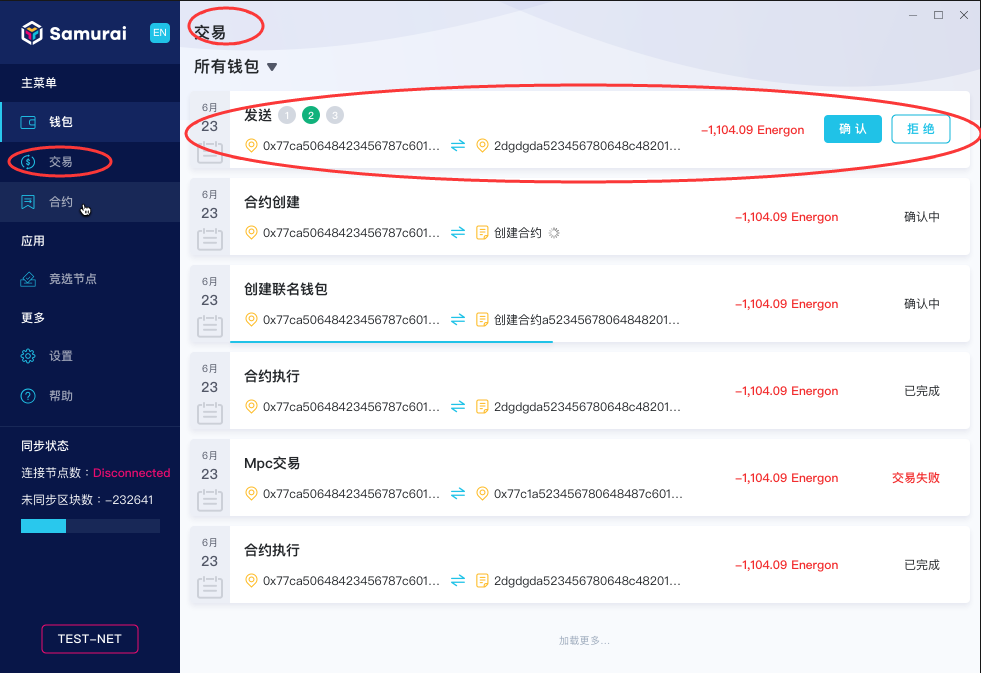
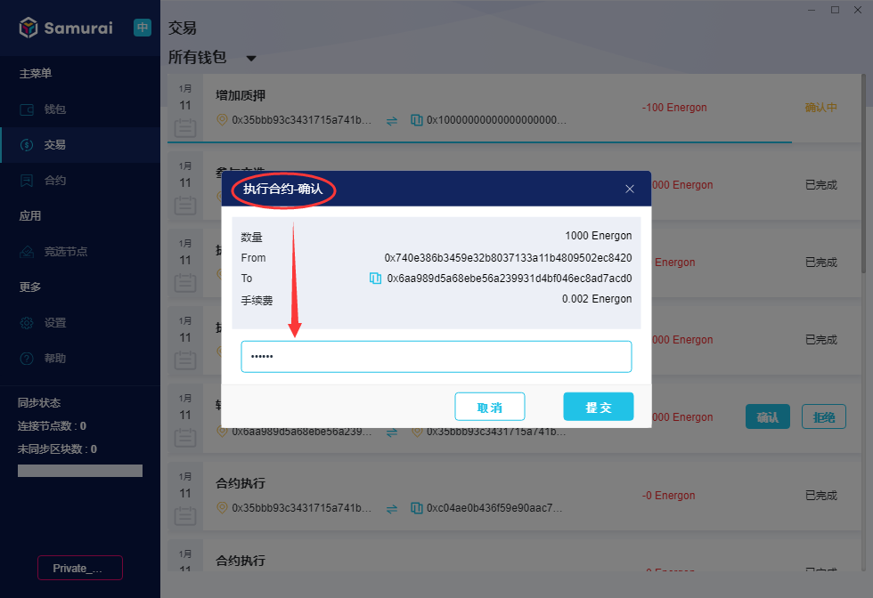
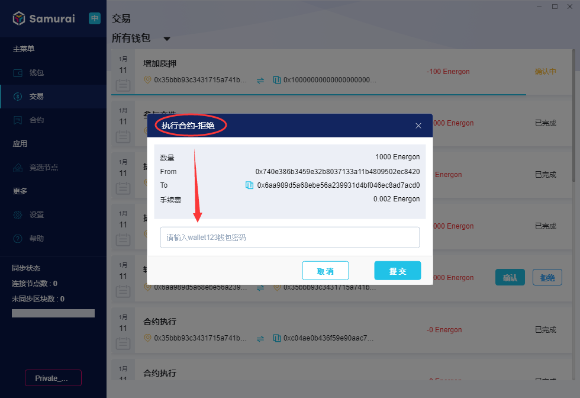

# 交易

## 如何确认交易

客户端【交易】页面，展示所有钱包的交易记录，点击可查看交易详情。

联名钱包需要多个联名用户签名确认，因此，在交易列表中，需要对联名钱包的待确认交易进行"确认"或者“拒绝”处理。

1. **确认**

交易列表中，对于待确认的交易，如下图所示：

点击【确认】，弹出确认对话框，如下图所示：

输入关联的普通钱包的【钱包密码】，点击【提交】，则该条交易确认完成。

2.**拒绝**

点击【拒绝】，弹出确认对话框，如下图所示：

输入关联的普通钱包的【钱包密码】，点击【提交】，则交易被本用户拒绝，但不能确定交易是否能执行成功，因为只要得到不少于设定的数量的签名，交易依然可以执行。

