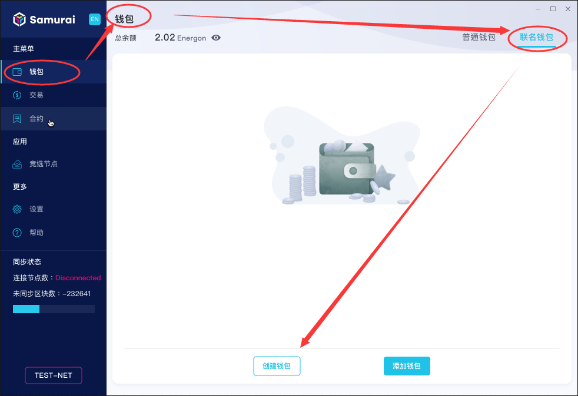
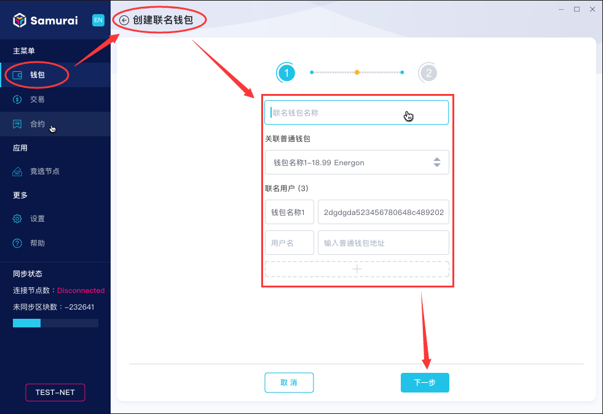
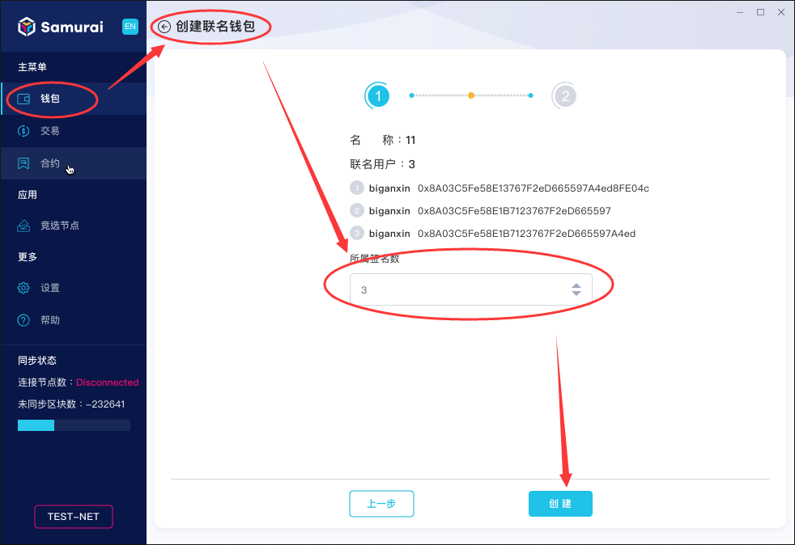
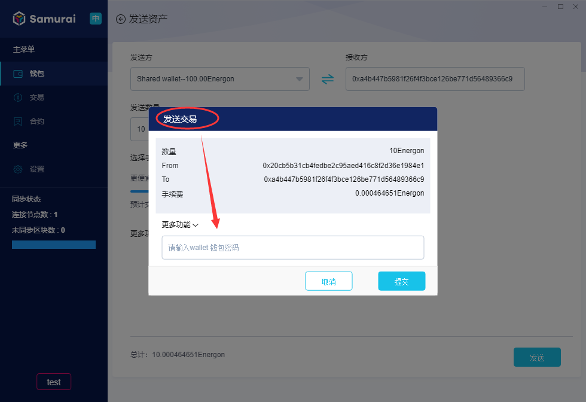
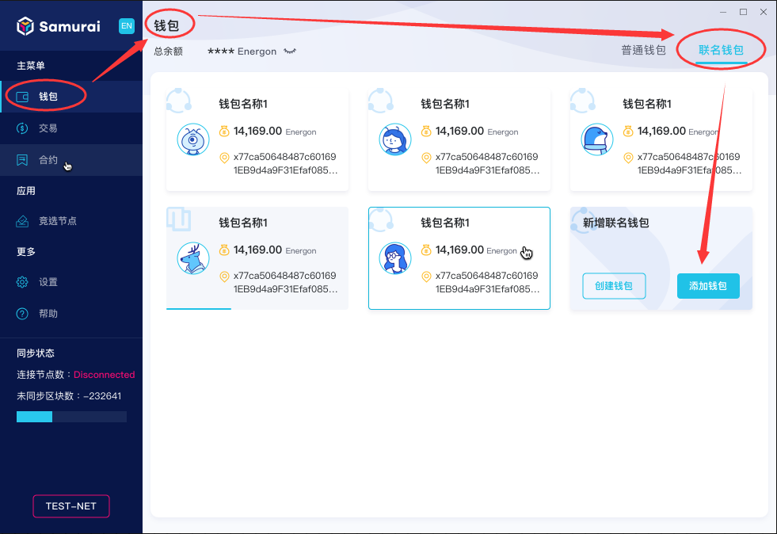
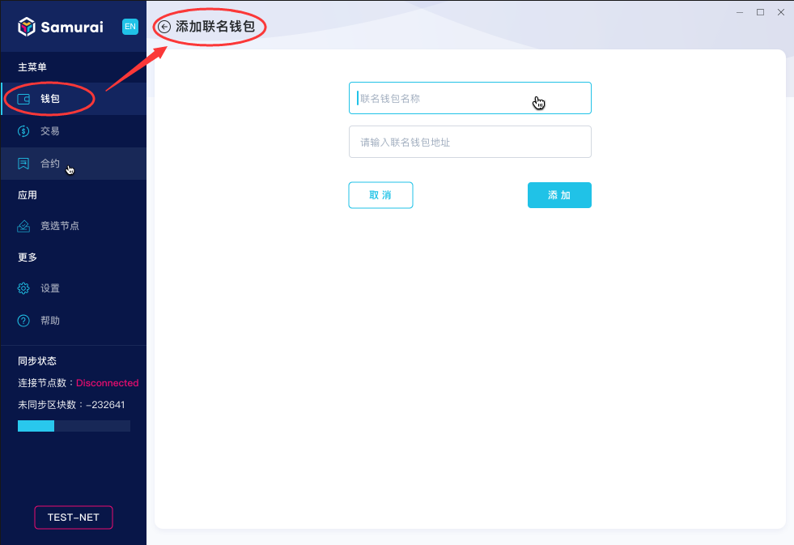
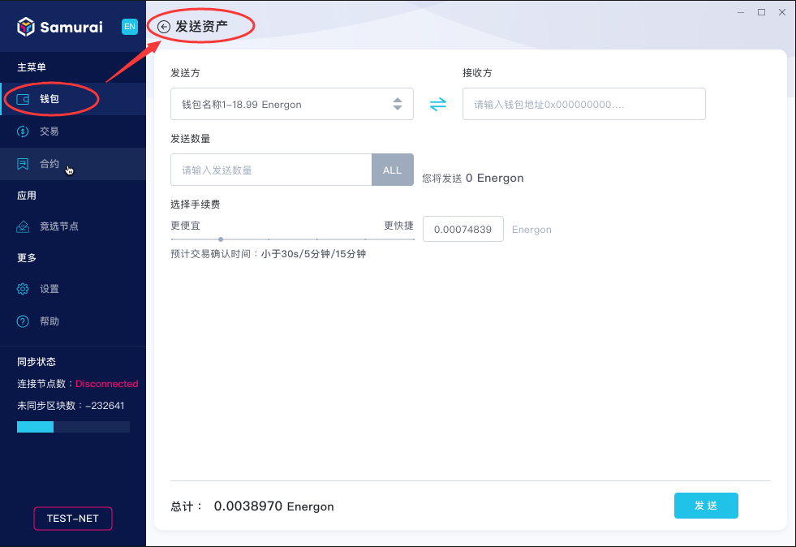
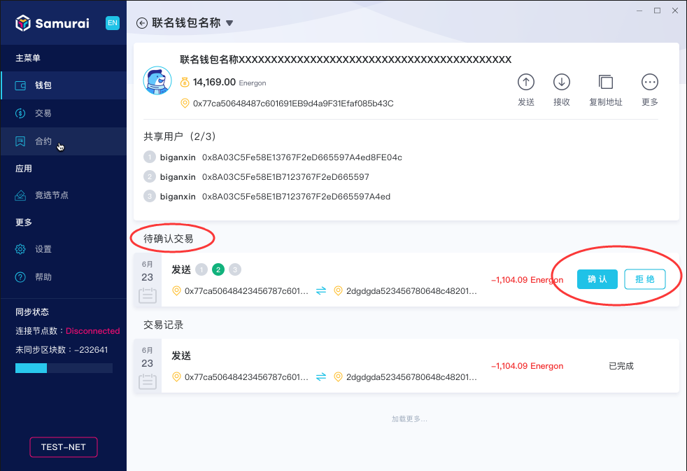
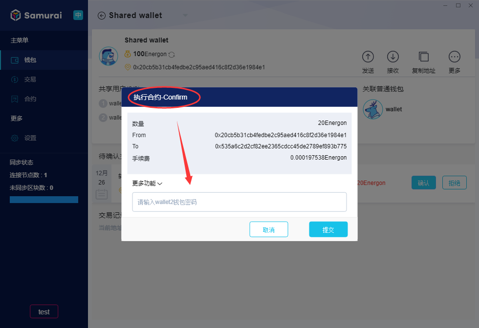
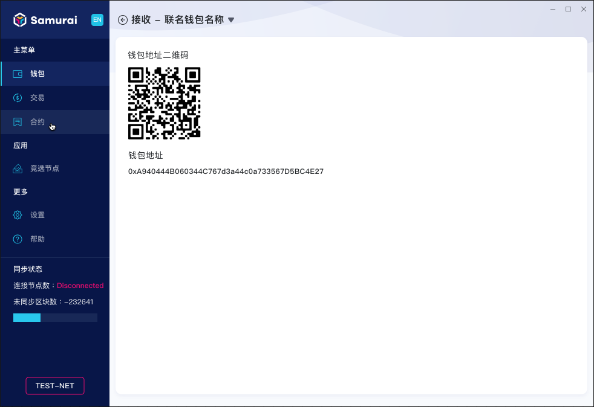

# 共享钱包

## 什么是共享钱包
共享钱包即由多个用户所共同控制和管理的数字钱包，共享钱包的转出，需要满足既定数量用户的确认签名后才能转出。

## 如何创建一个共享钱包

1.客户端【钱包】-【共享钱包】页面，点击【创建钱包】。如下图所示：

2.命名该共享钱包、选择【关联的普通钱包】和【共享用户】（至少两个，第一个为当前关联钱包），点击【下一步】，如下图所示：

3.设定【所需签名数】，然后点击【创建】，如下图所示：

4.在弹出的确认对话框中，输入关联的普通钱包密码，点击【提交】，如下图所示：

5.创建完成，钱包就会显示在【共享钱包】页面，等待一段时间即可使用。

## 如何添加已创建的共享钱包
共享钱包创建完成以后，其他共享用户可以将该共享钱包添加到自己的【共享钱包】之中，操作步骤如下：

1.在【钱包】-【共享钱包】页面，点击【添加钱包】，如下图所示：

2.进入【添加共享钱包】页面，自定义命名【共享钱包名称】、选择【关联普通钱包】、输入【共享钱包地址】，点击【添加】，如下图所示：

3.共享钱包添加完成，客户端自动同步共享钱包余额数据。

## 如何使用共享钱包发送、接收Energon

+ 发送Energon

1.点击【发送】按钮，切换页面内容如下图所示：

2.选择【发送方】，输入【接收方】，设定【发送数量】和【手续费】，点击【发送】，弹出确认对话框如下图所示：

3.输入发送的共享钱包关联的普通钱包的【钱包密码】，点击【提交】，则转账交易创建完成，在钱包详情可查看交易状态，如下图所示：

4.与普通钱包不同，共享钱包发送Energon，需要满足相应签名数确认，因此一笔交易发起后，需要当前钱包共享用户确认，该笔交易为“待确认交易”，钱包共享用户点击【确认】，弹出确认对话框，如下图所示：

5.共享用户输入关联普通【钱包密码】，点击【提交】，则交易通过该共享用户的确认，直至交易得到预设数量的签名，交易才能成功。

+ 接收Energon

点击【接收】按钮，切换页面内容如下图所示：

显示接收方钱包的【钱包地址二维码】、【钱包地址】，将二维码或钱包地址提供给发送者即可。

